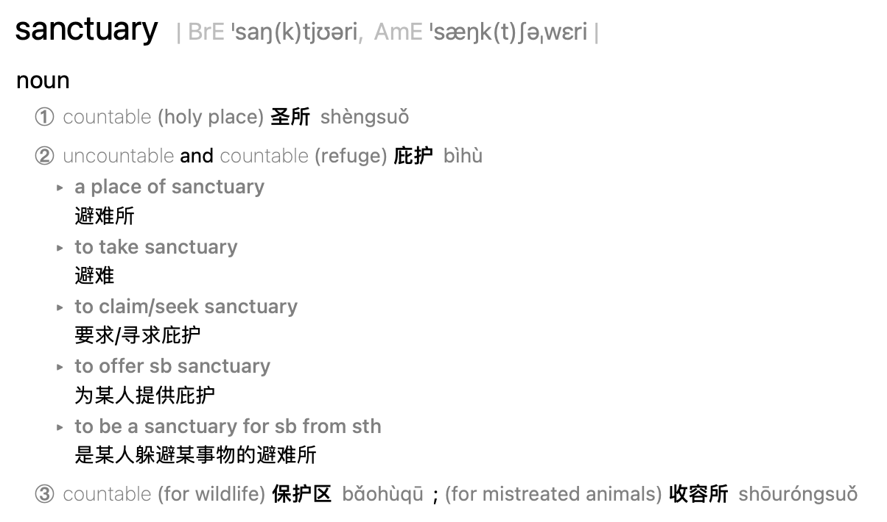

本期的Life Kit:
### 'Comfort Decorating' Is All About Making Your Home A Sanctuary

今天的Life Kit是给大家提供舒适装饰指导，将会介绍一些在家中创造宁静、高效和宁静空间的最佳方法。主持人采访了设计师Dabito和应用环境心理学家Sally。Dabito对室内设计、颜色的搭配都非常大胆和鲜明；Sally她告诉我们一个房间应该是什么颜色或形状，应该有什么样的灯光和陈列，使人们感觉更舒适或思考更具创造性。例如她说道拿绿色来装饰，肯定不会不出错，避免使用红色，卧室可以选择蓝色系列之类的等等。 

有时间一定要去听听哦，我相信你听完肯定会有说活的，在这里分享内容中提到的5个takeaway：
>Takeaway No. 1 - take a step back to first think about what you want or need to do in the space. And one of the best ways to do that is by dividing up your apartment or living room into different functional zones. Then you can start brainstorming on how you want to feel in the space.

先想想室内空间的功能，最好的方法之一就是把你的公寓或客厅划分成不同的功能区，然后你就可以开始头脑风暴，你想在每个不同的区域感受到什么。

>Takeaway No. 2 - color. If you can, let loose. Don't be afraid to follow your gut and start with the hues that bring you joy, or choose colors based on what you hope to accomplish in the space

颜色。如果可以的话，不要太拘束。不要害怕跟随你的直觉，从给你带来快乐的色调开始，或者根据你希望在空间中完成的事情来选择颜色

>Takeaway No. 3 - patterns and fabrics help our brains to break up a monotonous space. The trick is finding the right level of visual complexity that works for you.

图案和布料帮助我们的大脑打破单调的空间，诀窍是找到适合你的视觉复杂度。

>Takeaway number 4, comfort decorating is all about embracing nostalgia

舒适装饰就是拥抱怀旧

>Lastly, takeaway No. 5 - bring in some nature. Real plants, faux plants, a print of some nice scenery or wallpaper - it doesn't really matter as long as it reminds you that there is a world outside of your four walls.

借助自然。真正的植物，人造的植物，一些美丽的风景或墙纸的印刷品-只要它提醒你在你的四壁之外有一个世界，其实并不重要。

- - - - - - - 
### 往期文章
[Life Kit | 如何提出加薪？](https://mp.weixin.qq.com/s/GkmaXjpb6vYS8vfXqSaZ_A)
[Life Kit | 成为一个更好的倾听者的5种方式](https://mp.weixin.qq.com/s/sZSnl-k-5uLrYegFwlzxHQ)
[Life Kit | 6种方式帮助身边处在暴力关系中的受害者](https://mp.weixin.qq.com/s/ObewcuoDeqwZGQM2FIqSkA)
[Life Kit | 4种处理职业过劳问题的方式](https://mp.weixin.qq.com/s/VhYMO_YB20sNmUS_nPMp3g)

- - - - - - 
北京时间**每周六9pm**我会跟在腾讯会议上跟大家一起来分享和讨论Life Kit频道的内容。如果你也刚兴趣，请扫码加入
