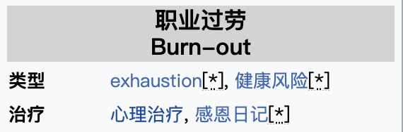

Burnout Isn't Just Exhaustion. Here's How To Deal With It
职业过劳哦不仅仅是精疲力尽。下面将分享如何解决这个问题

>Burnout的维基百科解释
>根据世界卫生组织，职业过劳（英语：Occupational burnout）是一种由慢性工作压力导致的症候群，症状包含“精神耗尽、对工作的心里距离增加、对工作的负面感觉、以及工作效率的减少”。

这集内容里也提到burnout的经历包括这三个阶段：
- 1 One is the exhaustion 精疲力竭
- 2 The second component is when you start to feel cynical about work 你开始对工作感到愤世嫉俗
- 3 And the third component is that you start to blame yourself 你开始自责

这集life kit 将会针对burnout 展开讨论，帮助你理解burnout时是一种什么样的状态，早起现象有哪些？有哪些方式可以帮助人们来识别这些现象以及还有哪些贴士可以帮助解决burnout问题。  

以下是这集内容的音频和我的笔记。(北京时间**每周六9pm**我会跟在腾讯会议上跟大家一起来分享和讨论Life Kit频道的内容。如果你也刚兴趣，文章末尾有加入方式)

待插入音频
- - - - - - - - - 
**01**
> Everyday normal things that would just weigh on my shoulders. Like, I remember feeling so defeated, like, thinking, oh, I haven't given my dog a bath. It was definitely real.

▸ weigh on: (be depressing or burdensome to someone) 压在
▸ defeated: 挫败的

**02**
> The World Health Organization **defines** burnout **as** a syndrome associated with chronic stress at work. The term has gained popularity in recent years **as** workplaces around the world now require people to do more and more, **leading to** more employees feeling burnt out
> 世界卫生组织将工作倦怠**定义为**一种与长期工作压力相关的综合征。近年来，**随着**世界各地的工作场所要求人们做越来越多的工作，这一术语越来越流行，**导致**更多的员工感到筋疲力尽

**03**
> I thought I knew what the word meant based on how we use it **colloquially**, like I'm burnt out or exhausted because I've been working too hard

▸ colloquially: (col·lo·qui·al·ly) 口语地

**04**
> Burnout is a risk factor for depression. It's a risk factor for substance use. It's a risk factor for suicidal ideations or suicidal thoughts. And so if you are burnt out, you should deal with it.
> 职业过劳是抑郁的危险因素。这是药物使用的危险因素。这是自杀意念或自杀想法的危险因素。所以，如果你精疲力尽了，你应该处理它。

▸ ideation: (the formation of ideas or concepts) 构想 

**05**
> She says the experience of burnout has three main components
> 1 One is the exhaustion 精疲力竭
> 2 The second component is when you start to feel cynical about work 你开始对工作感到愤世嫉俗
> 3 And the third component is that you start to blame yourself 你开始自责

**06**
> She's an **EMT** in California and is going to school to get her paramedic's license.

▸ EMT: Emergency medical technician
▸ 救护技术员可分为初级救护员（EMT-1）、中级救护员（EMT-2）和高级救护员（EMT-P）三个等级
▸ paramedic 护理人员

**07**
> And you could feel that they've been running all day. They're exhausted. And you can feel the negativity, but you kind of **steer away** from it because it can easily overlap

▸ sheer away: «person, horse, vehicle» 躲闪 
▸ to sheer away to the right/left 向右/向左闪躲

**08**
> One of the things that I tell people is trying to pause and take almost like an **inventory** of how you're doing
> 我经常告诉人们的一件事是试着停下来，像盘点自己的表现一样

▸ inventory: 清单
▸ 顺便记一下另一个看起来差不多的单词：itinerary 行程单

**09**
> If I can just keep going, I'll just make it through these feelings, and then I'm going to be OK. That's what puts you in this state of complete breakdown and overwhelm because we're not stopping and stepping back and saying, what do I have control over?
> 如果我能坚持下去，我会克服这些感觉，然后我会没事的。这就是为什么让你处于完全崩溃和压倒的状态，因为我们没有停下来退一步说，我能控制什么？

**10**
> I think sometimes we can rearrange our day to have some positives with some negatives so it's not a horrible day of just negative
> 我想有时候我们可以重新安排我们的一天，有一些积极的，有一些消极的，所以这不是一个可怕和消极的一天

**11**
> You know, the Serenity Prayer, sort of like accepting the things I can't change and dealing with what I can
> 接受不可改变的，改变可以改变的

**12**
> Dr. Gaurava Agarwal is a psychiatrist and a well-being coach at Northwestern Medicine, and he's the director of physician well-being there. He says a rest is key to preventing and addressing burnout.
> Gaurava Agarwal博士是西北医学的精神病医生和健康教练，他是那里的医学健康总监。他说，休息是预防和解决倦怠的关键。

▸ psychiatrist 精神病医生
▸ physician 医师 内科医生

**13**
> And so taking that five minutes in an hour or one day a week to your ability to **recuperate** is going to be a big part of dealing with that exhaustion

▸ recuperate:  恢复
▸ to recuperate from sth ‹operation, illness›; 从…中康复

### 4 ways to deal with burnout 四种处理职业过劳的方式
**Takeaway No. 1 **- burnout is bigger than you think. It stems from chronic stress at work and involves physical and emotional exhaustion, feelings of dread and cynicism about your work and a sense of shame and guilt. It has serious consequences on individuals' mental health. It's also contagious and affects workplaces and society at large.
第一： 倦怠比你想象的要严重。它源于工作中的长期压力，包括身心疲惫、对工作的恐惧和愤世嫉俗以及羞耻感和内疚感。它对个人的心理健康有着严重的影响。它还具有传染性，影响工作场所和整个社会。

**Takeaway No. 2** - take control of your workday. One way to do that is by developing a practice of checking in with yourself and how you're doing a few times during your workday. And pay attention to your negative emotions and what's causing them. It'll help you address the causes of those emotions and take some control over your work life because lack of control, lack of boundaries, is a big factor causing burnout.
第二：掌控你的工作节奏。其中一种方法是，养成一种习惯，在工作日定期检查自己的情况。注意你的负面情绪以及导致它们的原因。它将帮助你解决这些情绪的原因，并对你的工作生活采取一些控制，因为缺乏控制，缺乏界限，是一个很大的因素造成倦怠。

**Takeaway No. 3** - know when you're working too much, and find ways to make your workload more manageable, and prioritize rest - every day, every week - and use those vacation days you've been saving for a year
第三，知道什么时候你工作太多了，想办法让你的工作量更容易管理，每天把休息放在优先位置，多多利用那些你攒了一年的假期

**Takeaway No. 4** - workplace structures and culture have a big impact on burnout risk, things like absence of social support at work or presence of bullying and discrimination, so workplace leaders have a very big role in both preventing and addressing burnout. Ultimately, it's more than individuals taking care of their own
工作场所的结构和文化对工作倦怠的风险有很大的影响，比如工作中缺乏社交支持或者存在欺凌和歧视，所以工作场所的领导者在预防和解决工作倦怠方面都有很大的作用。归根结底，不仅仅是个人照顾自己
