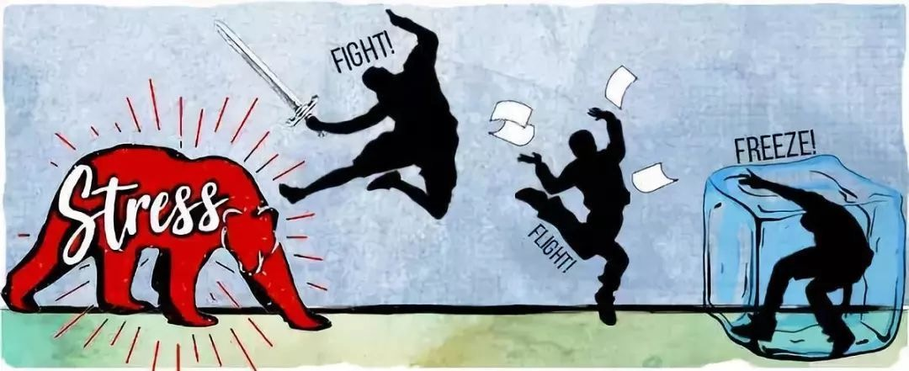

Life Kit: Turn Down Your Thoughts And **Tune In** To Others
▸ to tune in to sth; 收听 ‹channel, frequency›
▸ to tune in to sb's way of thinking 理解某人的思维方式
▸  stay tuned 敬请关注 敬请期待

这集的life kit针对如何成为一个更好的倾听者展开讨论。
做一个好的倾听者不仅仅是在别人说话的时候身体杵在那里。
如果倾听被正确地完成，那就是一种行动。
当人们遇到观点冲突时，倾听往往难以正确地被完成。 
但是，you can still hold your own views and be interested in and respectful of somebody else's

这里附上「如何成为一个更好的倾听者」的5个小建议，供参考：
- Takeaway No. 1, shut up and listen.
- [x] Takeaway No. 2, summarize and build @2021-04-26 11:32:42
- Takeaway No. 3, be patient
- Takeaway No. 4, listen with intent
- Takeaway No. 5, listening is an act of power 

以下是这集内容的音频和我的笔记。(北京时间**每周六9pm**我会跟在腾讯会议上跟大家一起来分享和讨论Life Kit频道的内容。如果你也刚兴趣，文章末尾有加入方式)

- - - - - - - 

**01**
>And today, we're talking about something that genuinely feels **mundane** but is actually a much deeper habit
今天，我们谈论的是一种真正让人觉得“平凡”但实际上是更深层的习惯的东西。

▸ mundane: 平凡的

**02**
> You're washing dishes or you're walking your dog or **mindlessly scrolling the Internet**
你可能正在洗着碗，遛狗，或者**漫不经心地上着网**

**03**
> But there's a big difference between **hearing** something and **listening**
听和倾听是不一样的

**04**
> **To start off**, I want to **set** us all **up** for success, so I want you to take a deep breath in and slowly let it out
**首先**，我想让我们大家都为成功做好准备，所以我想让你们深吸一口气，慢慢地把它吐出来

**05**
> Being a good listener involves a lot more than just hanging out while another person is speaking. **When done right, it's an action**
做一个好的倾听者不仅仅是在别人说话的时候身体杵在那里，如果倾听被正确的完成，那就是一种行动

**06**
> So just to start off here, we're not telling you to give air time to just anybody, regardless of their intentions.
首先在这里我们不是告诉你对任何人都付出时间去听，不管他们的意图是什么？

**07**
> And one of the ways to remember this is that if you rearrange the letters of the word listen, it spells **silent**
记住这一点的方法之一是，如果您重新排列“listen”一词的字母，它会拼写“silent” 沉默的

**08**
> I think everybody will recognize the situation where you want to be prepared and reply with that perfect thing or the best idea, so you just start **stockpiling** your **proverbial** arguments.
 我认为每个人都会意识到要做好准备的情况，并以最完美的想法或最好的主意来回答，因此您只需开始收集众所周知的论点。

▸ stockpile 大量储存
▸ proverbial 谚语的  谚语表达的 众所周知的  

**09**
> Tania says that listening is especially difficult when you're in conflict or if it's a difficult conversation. Sure, you might be trying to make a very reasoned point about the minimum wage, but your heart is racing and your **pupils** are **dilating** because your **fight-or-flight response** is on.
Tania说，当你处于冲突中或者谈话困难时，倾听是特别困难的。当然，你可能会试图对最低工资提出一个非常合理的观点，但你的心跳加速，你的瞳孔扩大，因为你的战斗或逃跑的反应开启了。

▸ pupil: 瞳孔
▸ dilate /ˈdīˌlāt/ 扩大
▸ fight-or-flight response: 应激反应

**10 **
> And so our bodies respond to all threats as if it's a saber-toothed tiger, even if that threat is actually somebody disagreeing with us in an **elevated tone**. And so we are still **kicking into** fight, flight or freeze response.
因此，我们的身体对所有威胁的反应就好像是一把剑齿虎一样，即使该威胁实际上是有人**高声**反对我们。因此，我们仍会开启战斗-逃跑-僵住模式。

▸ elevated: 提高的
▸ kick into： 开始见效 起作用
▸**Fight-Flight-Freeze response** is the body's automatic, built-in system designed to protect us from threat or danger.

Fight, Flight or Freeze Response简称3F反应，逃避反应，人类漫长的进化中一个重要的本能反应，它被保存在了我们的基因中，3F反应在遇到危险时（不管这是真实的：如前方路上有条蛇，或我们自己认为的：一个不认识的又高又大的人）会瞬间启动，通过一系列的神经反应与激素分泌（如肾上腺素），让我们有更高的警觉性和觉察能力，同时也有更多的力气去对抗或逃跑，而僵住，也可以译成吓呆，这个反应也有进化的意义，很多动物会在遇到天敌时装死，通过僵住不动让自己看起来没有那么显眼，从而增加自己生存下来的机会。

**11**
> It's somehow problematic because it's like they are supporting a different view if they just listen to it and if they don't argue back about it. And so if you come from a place of **intellectual humility**, you're really coming from a place of recognizing that you can still hold your own views and be interested in and respectful of somebody else's
这在某种程度上是有问题的，因为好像他们只是在听另一种观点而又不反对这一观点，就是在支持另一种观点。因此，如果你来自“知识分子谦卑”的地方，在这个地方你仍然可以持有自己的观点并对他人的观点感兴趣并尊重他人。

▸**humility**: hu·mil·i·ty /(h)yo͞oˈmilədē/谦逊
▸ **Intellectual humility** is often described as an intellectual virtue, along with other perceived virtues such as open-mindedness, intellectual courage and integrity, and in contrast to proposed intellectual vices, such as pride and arrogance. 
**智力谦卑**通常被描述为一种智力美德，与其他感知美德（例如思想开放，智力勇气和正直）以及与提议的智力劣势（例如骄傲和傲慢）形成鲜明对比。

**12**
> Listening and respect go hand in hand.
倾听和尊重是相辅相成的。

**13**
>** Reflective listening** means that when you're listening to somebody, when you respond, rather than responding with your opinion or something that contrasts with what they've said or even whether you agree or disagree, you respond by summarizing what they've just said. So they say something, and you summarize their perspective or what they've just shared and ideally, you know, some small piece that seems meaningful to them
反射倾听意味着，当你在倾听某人的声音时，当你做出回应时，而不是用你的观点或与他们所说的话形成对比的东西，甚至是你是否同意，而是通过总结他们刚刚说的话来做出回应。所以他们说了些什么，你总结了他们的观点或者他们刚刚分享的东西，理想的情况是，任何小片段都有意义

**14**
> If you really want to be a good listener, you have to be willing to slow down and at the very least, let them finish speaking. And sure, there's a huge focus on productivity and speed that can get in the way of slowing down, but active listening means sharing your time. **Don't let our multitasking, hypercompetitive world hustle you out of that**
如果你真的想成为一个好的倾听者，你必须愿意放慢脚步，至少让他们说完。当然，有一个巨大的重点是生产力和速度，可以得到的方式放慢，但积极倾听意味着分享你的时间。不要让我们的多任务、竞争激烈的世界把你从这个世界中赶出来

#### 往期文章
[Life Kit | 6种方式帮助身边处在暴力关系中的受害者](https://mp.weixin.qq.com/s/ObewcuoDeqwZGQM2FIqSkA)
[Life Kit | 4种处理职业过劳问题的方式](https://mp.weixin.qq.com/s/VhYMO_YB20sNmUS_nPMp3g)
[Life Kit | 如何处一段健康的长久的关系？](https://mp.weixin.qq.com/s/wAH1QdNR3g43y0vIoZsAtg)
#### 加入方式
a