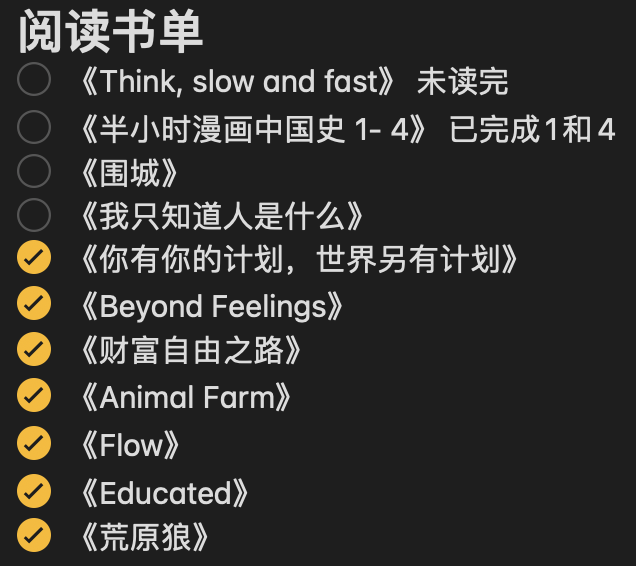

前两天稍微整理了一下我2020的阅读书单和听书书单，整理完后发现自己都不好意思分享，数量我一个手都可以数过来，很惭愧，听过的书现在也没有多少印象。

在2020年你读了多少书？

今天的播客内容关于「How to read more books」，我听完后带给我的变化是，我要开始记录和追踪我的阅读记录。 这集内容总共提供了4个tips，希望对大家有点参考作用，下面我会放上音频内容和我的学习笔记。
(北京时间每周日10pm我会跟在腾讯会议上跟大家一起来分享和讨论Life Kit频道的内容。如果你也刚兴趣，文章末尾有加入方式)

- - - - - 
**01**
> but I have been halfway through Michelle Obama's memoir, "Becoming," for **upwards of** six months

但是我已经看了米歇尔·奥巴马的回忆录《Becoming》已经超过六个月
memoir: 回忆录
upwards of 多于
upwards of $50 ： 50多美元

**02**
>And actually, there's an entire pile of books in the corner of one room that used to be on my nightstand until they felt too **judgmental** of me, and I had to move them.

事实上，在一个房间的角落里有一大堆书，以前放在我的床头柜上，直到他们觉得对我太挑剔，我不得不搬走它们。
judgmental: 挑剔的

**03**
>Your very own **queendom**

queen 女王 + dom 情况 身份 状态 性质 ==> 女王身份
dom作为后缀的两层意思：
1 ~dom 领域…界
filmdom  电影界
kingdom 王国

2 ~dom 情况 身份 状态 性质
boredom 厌烦
freedom 自由
random 任意的 随机的
wisdom 智慧

**04**
>Read the way you like to read because it should be something that's pleasurable
以你喜欢的方式阅读，因为它应该是令人愉快的

**05**
>Lynn also has the same struggle that many of us do, that **transfixing** **pull** of literally all other forms of entertainment

Lynn也有着和我们很多人一样的挣扎，那是所有其他娱乐形式的惊人吸引力
transfix: 使动弹不得 使惊呆 
pull： 吸引力   countable figurative (attraction) 

**06**
>I think the idea of binge-watching TV is one of the biggest competitions for me **with** reading because as a reader and as somebody who loves stories and narratives, I think there's such great television out there right now. And it's just easier for me to watch television than it is to read a book.

我认为疯狂看电视是我与阅读最大的竞争之一，因为作为一个读者和一个喜欢故事和叙事的人，我认为现在有这么好的电视节目。对我来说看电视比看书更容易。

**07**
>Reading in the morning might not work for you depending on where you're at in your life or what time your alarm **goes off**. But it feels, like, **counterintuitive**, which I think might mean that it's a brilliant idea.

早上看书可能对你不起作用，这取决于你在生活中的位置或者闹钟什么时候响。但这感觉很反常，我想这可能意味着这是一个聪明的想法。
 go off: (sound) «alarm» 响起
counterintuitive: 反常的

**08**
>The hardest part about reading a book is just opening the book.

读一本书最难的部分就是，打开书。

**09**
>I think a lot of people, when they sit down and they read, it's not hard to get lost in it. It's not hard to just actually read the book. It's just easy to be distracted by your phone and any other number of things going on in your life. So I think part of it is, you know, we have this imagination of like, oh, reading time is, like, this **luxurious** thing.

我想很多人坐下来看书的时候，阅读反而不难，被书吸引进去也不难。但你很容易被手机和生活中发生的其他事情分心。所以我想部分原因是，我们对阅读时间的想象就像是一件**奢侈的**事情。

**10**
>Michelle will never know if I read her book on my phone while I'm standing on the subway platform avoiding my **nemesis**, a subway **busker** who plays "Free Fallin'" by Tom Petty every single morning

Michelle永远不会知道，当我站在地铁站台上躲避我的死敌时，我是否用手机读过她的书。我的死敌是一个地铁街头艺人，每天早上都会演奏汤姆·佩蒂的《自由坠落》
nemesis: 死敌 克星
subway busker: 地铁街头艺人

**11**
>It's a **built-in** thing in your day. You're driving to work. It's audiobook time. You get on the subway. It's time to open the book. I'm not going to play video games on my phone or listen to a podcast. It's really easy to have that kind of discipline because it's sort of **sequestered** part of your day where you decide, I'm doing this thing at this time.

这是你生活中固有的东西，你开车去上班了现在是有声读物的时间；你上地铁了，该打开书了。我不会在手机上玩视频游戏，也不会听播客。拥有这样的纪律真的很容易，因为这是你决定的一天中固定的一部分去做这个事情。
built-in：内置的
sequestered:  səˈkwestərd 隔离的

**12**
And those minutes **add up** a lot
add up 累积

**13**
>And that's part of the feeling of accomplishment and **momentum**. It's funny how, like, **quantifying** these things can actually be pretty encouraging. I know, like, if you do CrossFit, you know, like, you write down your exercise and your times that day, which sounds very **corny**, but there's no reason that you can't keep track of that

这就是成就感和动力的一部分。有趣的是，量化这些东西实际上可以令人鼓舞。例如，如果你在CrossFit坚持健身，写下了每天的运动项目和时间，这听起来很俗，但没有理由不去做下记录对不对。
momentum: 动力
quantify: 量化
corny: 老掉牙的

**14**
>Both Kevin and Lynn told me that it's important to accept that not every book is going to be the one that **grabs** you. 
When you start a book, sometimes, it feels like this promise that you're making to yourself. But I think it's important to say here that you have to be able to let it go if you can't **push through** a book. You don't have to like every book.

Kevin和Lynn都告诉我，重要的是要接受不是每本书都会**吸引**你。当你开始写一本书的时候，有时感觉就像你对自己许下的承诺。但我认为在这里有一点很重要，那就是如果你不能读完一本书，你必须能够放手。你不必喜欢每一本书。
grab: 抓住，吸引
push through:  使... 获得批准，但这里应该是努力完成的意思

**15**
>First, don't be afraid to read first thing in the morning before your whole day happens to you. 
>Second, read in the **in-betweeny moments**, especially when you're already trapped somewhere or commuting. 
>Third, match the book you're reading to the amount of time that you have. 
>And finally, track your reading so that you can feel like you're really getting somewhere

首先，早上第一件事就是阅读。
第二，碎片时间阅读，特别是当你已经被困在某处或通勤时。
第三，将你正在读的书与你所拥有的时间相匹配。
最后，跟踪你的阅读，这样你就可以感觉到你真的有进展了
in-betweeny moments: 碎片时间 

**16**
>I'll be back soon with more tips that will make you turn into that one emoji that has, like, the nerd glasses and the little teeth on it

🤓🤓🤓 希望你们都是爱读书的nerd : )
