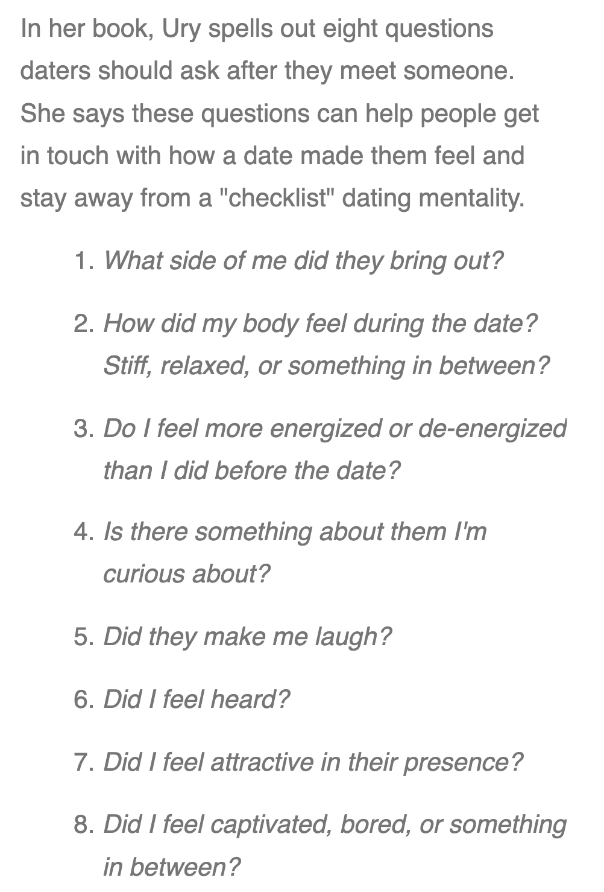

Life Kit: How To Fall In Love, According To Hinge's Relationship Scientist
根据Hinge的关系科学家，如何坠入爱河
TODO插入图片

这集Life Kit的采访主持是Dates & Mates Podcast的主持人，对dating也是有很多的看法，被采访的嘉宾是Hinge(一个比较严肃的dating app)关系科学家Logan Ury，她的前身是谷歌行为科学家，有写过一本书《How to not die alone》，涉及到的内容有如何识别你的恋爱盲区，可以做点什么来帮助你脱离盲区，“火花“真的很重要吗？其实内容除了提供约会建议外，还涉及到很多价值观的讨论，例如MVP， minimal viable product，最小可行性产品，growth mindset 成长型心态等等，非常建议大家去听听看。 

文末我放了你可以做的3件事情来改变提升你的爱情生活。 下面我放上了这集内容的音频和我的学习笔记。
(北京时间每周日10pm-11pm我会跟在腾讯会议上跟大家一起来分享和讨论Life Kit频道的内容。如果你也刚兴趣，文章末尾有加入方式)

TODO插入音频
- - - - - - -
**01**
> The title is not so subtle 
▸ the title 指的是《How to not die alone》
▸ subtle： 微妙的 巧妙的 

**02**
>She's a Google behavioral scientist turned dating coach

她是谷歌行为科学家，后来是dating 教练

**03**
>I say in the book that the spark became my **nemesis** because I **felt like** my clients were looking for this thing that they had seen in the romantic comedy, that they had seen in a Disney movie, and they felt like if they didn't feel it right away, then why give someone else a chance?

我在书中说，火花成了我的**死敌**，因为我**觉得**我的客户在寻找他们在浪漫喜剧中看到的东西，他们在迪斯尼电影中看到的东西，他们觉得如果他们没有马上感觉到，那为什么要给别人一个机会呢？
▸ nemesis: nem·e·sis  劲敌 死敌

**04**
>And if I don't like the direction that I'm **headed** in, then I need to change course, and I need to shift my behavior. I need to shift my attitude. I need to do something else

而且，如果我不喜欢前进的方向，那么我需要改变方向，并且需要改变自己的行为方式。我需要改变态度。我需要做点其他的事情
▸ to head west/in the wrong direction 朝西/朝错误的方向前进
▸ to head home 回家

**05**
>A: You need to put a process around finding love
>B: that's not romantic

你需要一个寻找爱情的过程

**06**
>My philosophy is called **intentional** love, and this is a way of looking at the world and of looking at your love life.

我的哲学叫做有意的爱，这是一种看待世界和你的爱情生活的方式。

**07**
- The **Romanticizer**: If you are caught up in the fairytale about how you want your love story to play out, this could be you.  And so the romanticizerhas unrealistic expectations of relationships.
- The **Maximizer**: If you are a swipe addict with a checklist of qualities for the next best match, you fall into this category. So the maximizer has unrealistic expectations of their partner.
- The **Hesitator**: If you have trouble getting started dating or have a million reasons for why this isn't your time to find love, this is definitely you. So hesitator isn't even dating because in their mind, they're not ready to date yet
在恋爱时，人一般可以分为三类
**浪漫主义者**：如果你沉浸在童话故事中，想让你的爱情故事继续下去，这可能就是你。所以**浪漫主义者**对爱情有不切实际的期望。
**最大化主义者**：如果你是一个swipe(dating app里提供的功能，左滑match, 右滑拒绝)上瘾者，有一个下一个最佳匹配清单，你就属于这一类。所以最大化主义者对他们的伴侣有不切实际的期望。
**犹豫不决者**：如果你在开始约会时遇到了困难，或者有无数的理由解释为什么现在不是你寻找爱情的时候，那么这绝对是你。所以犹豫不决者甚至没有约会，因为在他们的脑海里，还没有准备好约会。

**08**
>The romanticizer - we identified that their dating blind spot is that they have unrealistic expectations of relationships, and so they need to make a shift to the **work-it-out** mindset

浪漫主义者-我们发现他们的盲区是他们对关系有不切实际的期望，所以他们需要转变到“**解决问题**”的心态

**09**
>When you hit an **inevitable** rough **patch**, you say, is this someone with whom I can **navigate** challenges and make hard decisions?

当您遇到**不可避免的**困难时，我可以和这个人一起**应对**挑战并做出艰难的决定吗？
▸ patch: 英国比较常用的非正式的表达，**时期**的意思 
▸ to go through a bad or sticky patch 经历一段艰难时期
▸ to hit a bad or sticky patch 陷入困境

**10**
>It's not just going to **strike** like a lightning **bolt**.

它不仅会像闪电一样**击中**。
▸ a bolt of lightning 闪电 

**11**
>You know, everyone has to research everything they ever buy on **wirecutter** before they make a decision

你知道，每个人在做决定之前，都要研究他们在wirecutter上买的所有东西
▸ Wirecutter is a product review website owned by The New York Times Company. It was founded by Brian Lam in 2011 and purchased by The New York Times Company in 2016 for about $30 million. Wikipedia

**12**
>And so this is a line of mathematical thinking called **optimal stop theory**. You don't want to choose too early because maybe all the good candidates are at the end, but you don't want to choose too late.  And so the mathematically correct answer is 37%

这是一种数学思想，叫做**最优停止理论**。你不想选择得太早，因为也许所有优秀的候选人都在最后，但你不想选择得太迟。 所以数学上正确的答案是37%

**13**
>And you really need to work on accepting yourself and putting yourself out there, as opposed to imagining that one day you'll just wake up and be completely perfect and suddenly ready to date

(针对犹豫不决者)，你真的需要努力接受自己，把自己摆出来，而不是想象有一天你会醒来，非常完美了再准备去约会

**14**
>Yes. And it's sort of that - in business, that **MVP** mindset, where you just start with your **minimum viable product**

对。这是一种在职场中称为MVP的心态，你只需要从你的**最低可行产品**开始

**15**
>I want to know what you mean by that and why, as a behavioral scientist, you feel that the spark leads us **astray**

我想知道你这么说是什么意思，为什么作为一个行为科学家，你觉得火花会把我们引入**歧途**

**16**
> I just didn't feel the spark. And this was just **catchall** word that people would use to say, I just didn't feel this instant chemistry. I just didn't feel this **pang** of excitement.

我只是感觉不到火花。这是人们常说的**流行语**，我只是感觉不到这种瞬间的化学反应。我只是感觉不到这种兴奋。
▸ pang: 一阵 a very strong, sudden, and unpleasant pain or emotion
▸ a pang of guilt  一阵内疚

**17**
> And so I have that chapter, as you described, called "F The Spark." And in it, I **debunk** three myths around the spark.

所以我有一章，正如你所描述的，叫做“去TM的火花”。在这一章中，我揭穿了围绕火花的三个神话。
debunk: 揭穿…的真相

**18**
> Some people are just really **sparky**. They give everyone the spark. They're really hot. They're really charming. And maybe they're really **narcissistic**.

有些人真的就是”发光“，他们给了每个人火花，他们真的看起来有魅力，很迷人，也许他们真的很自恋。
▸ narcissistic: nar·cis·sis·tic /ˌnärsəˈsistik/ 自恋

**19**
> But tell me what (do) you think **unfolds** in that second date and why you recommend people give it more than one meeting

但是告诉我你认为第二次约会会发生什么，为什么你会建议人们不止开一次会

**20**
> So for anyone who's having heart **palpitations** right now about the first date (laughter) - I know that does create a lot of anxiety. 

所以对于那些现在对第一次约会**心悸**的人（笑声）——我知道这确实会引起很多焦虑。

**21**
> We focus so much on how do I **tap dance** to impress this person, rather than being in the moment and really responding to what you're sharing together

我们如此关注如何想着来打动这个人，而不是关注当下，真正回应你们在一起分享的东西

**22**
>It's the pre-date ritual, designing dates that are fun and lead to connection and skipping the small talk. And then afterwards, answering the **post-date eight** so you can really tune in to what side of you that person brought out.

这是约会前的仪式，设计有趣的约会，建立联系，跳过闲聊。然后约会完后回答这8个问题，这样你就可以真正了解相处时你在展现你的哪一面

- - - - - 
**Here are three things you can do today to shift your love life for good**:
**1 Develop a growth mindset**: If you look at dating as a set of learned skills and see the process as a learning opportunity, you'll be less stressed about each individual interaction.  
**培养成长型思维**：如果你把约会看作是一套学到的技能，把约会过程看作是一个学习的机会，那么你对每一次个人交往的压力就会更小。

**2 Create a pre-date ritual**: Figure out what gets you into a good dating mood. Maybe it's a specific playlist or outfit you like to wear, or perhaps it's a call to your best friend to hype you up. Make sure you enter each date from a place of optimism and possibility.
 **创造一个约会前的仪式**：找出什么能让你进入一个好的约会心情。也许这是一个特定的播放列表或你喜欢穿的衣服，或者这是一个电话给你最好的朋友。确保你去的每一个约会都是带着乐观的心态

**3 F the spark**: This is actually one of the chapter titles in How to Not Die Alone. Chasing the spark based off of initial chemistry alone is a losing battle — and I have witnessed this too, among my clients and podcast listeners. Instead of prioritizing butterflies, look for deeper elements of connection and a window into your date's values. Go on that second date and see what unfolds.
这实际上是书《如何不孤独地死去》一章的标题之一。仅仅从最初的化学反应中寻找火花是一场失败的战斗——我在我的客户和播客听众中也目睹了这一点。与其优先考虑蝶型，不如寻找更深层次的联系元素和了解约会对象价值观的窗口。继续第二次约会，看看会发生什么。

**往期文章**

**加入方式**

