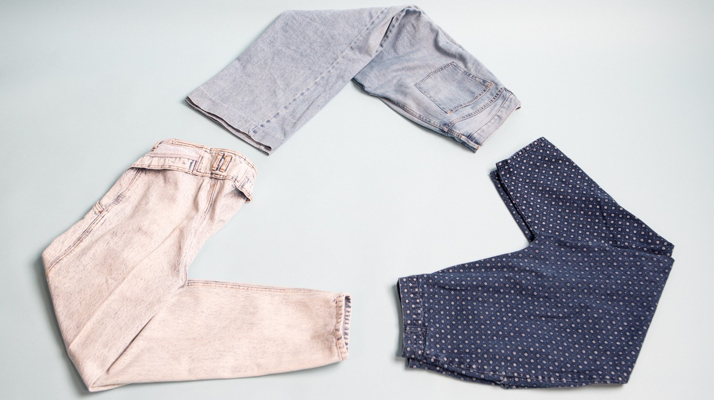

本期的Life Kit:
>Life Kit: Making Ethical, Sustainable Clothing Choices 做出合乎道德的可持续的服装选择
 
这集内容是帮助我们改善消费习惯，养成更好的消费价值观。如何做选择来帮助保护环境，延长衣服的生命周期。

因为现在的技术解决方案还没有达到规模，几乎所有的丢弃的衣物都将进入垃圾填埋场。更甚，衣服对当下的很多消费者来说太便宜了，但却带来了难以估量的环境和人力成本，

你知道吗？单条牛仔裤生产了大约1,800加仑的水，需求市场之大，需要快速并且经济的去生产，工厂里的工人往往薪水不足且不安全的。不是建议不要再购物了，但确实有一些方法来聪明购物。 

下面是6个方法，供你参考，如果你想听更加详细的内容，请听原版音频。
1. Don't think of your clothes as disposable. Change your mindset about clothes. Buy them expecting those clothes to be with you for the **long haul**, and take better care of them once they're yours
不要认为你的衣服是一次性的。 改变你对衣服的看法。买衣服时就开始想这些衣服能将会和你长期在一起，一旦它们是你的，就要好好照顾它们

2. Learn how to revamp what you've got.
学习如何改造你已经有的衣服

3. When you want to say goodbye, get rid of your clothes **responsibly**. Give or resell to people who actually want what you've worn
当你想对你的衣服说再见的时候，**负责任的**去丢弃。给与或转售给那些真正想要你所穿衣服的人

5. Buy secondhand. So many apps and sites make that possible, and physical thrift stores still abound in every town.
买二手的衣服。如此多的应用程序和网站使得这成为可能，而实体二手商店在每个城镇仍然比比皆是。

6. And finally, get educated. Learn about greenwashing to make better choices.
最后，学习！了解环保知识，做出更好的选择

- - - - - - - 
### 往期文章
[Life Kit | 如何提出加薪？](https://mp.weixin.qq.com/s/GkmaXjpb6vYS8vfXqSaZ_A)
[Life Kit | 成为一个更好的倾听者的5种方式](https://mp.weixin.qq.com/s/sZSnl-k-5uLrYegFwlzxHQ)
[Life Kit | 6种方式帮助身边处在暴力关系中的受害者](https://mp.weixin.qq.com/s/ObewcuoDeqwZGQM2FIqSkA)
[Life Kit | 4种处理职业过劳问题的方式](https://mp.weixin.qq.com/s/VhYMO_YB20sNmUS_nPMp3g)

- - - - - - 
北京时间**每周六9pm**我会跟在腾讯会议上跟大家一起来分享和讨论Life Kit频道的内容。如果你也刚兴趣，请扫码加入

