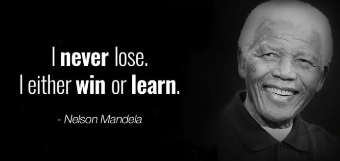
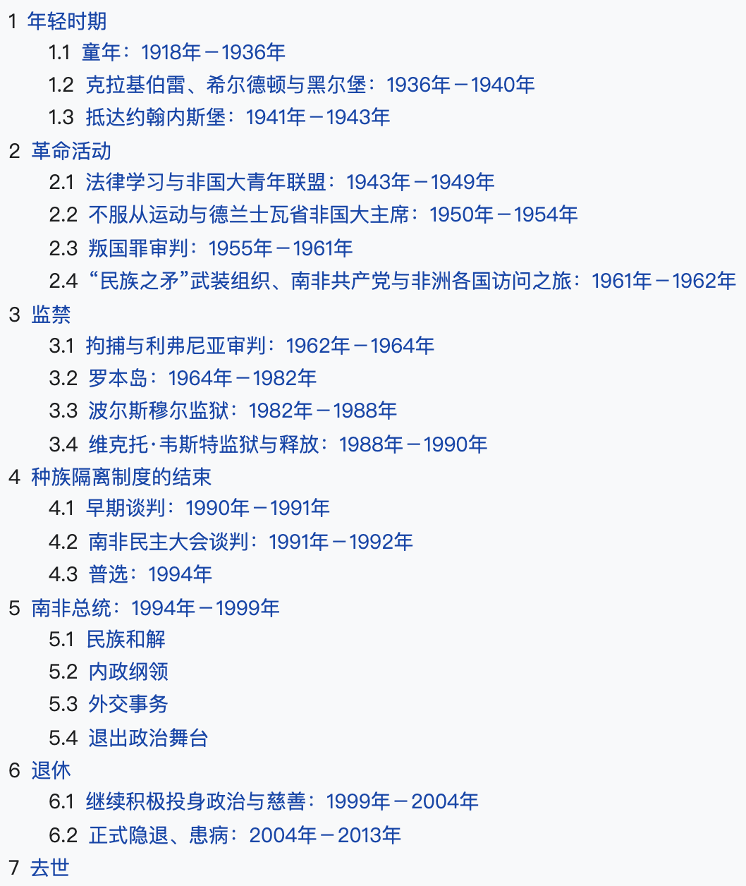

从今天起，开启名言专区，定期分享名人名言。文章不仅仅包括格言，我会尽量去搜集这句话的出处和作者及作者的信息。如果有可能的话，作者是在什么情况下写出来这样的格言。

今天的Quote是：
>  I never lose. I either win or learn. -Nelson Mandela

没有所谓的失败，我要么成了，要么我成长了。

只要你决定开始去做，这个事情就成了一半，全心参与过程，相信过程的力量，结果并不是那么重要。 

曼德拉，享年95岁，  2013年12月5日去世。当选总统前，曼德拉是积极的反种族隔离人士，任非洲人国民大会武装组织民族之矛领袖。当曼德拉领导反种族隔离运动时，南非法院曾判处他“密谋推翻政府”等罪名，曼德拉前后共服刑**26**年半，其中有约13年在罗本岛度过。

2009年11月11日，第六十四届联合国代表大会通过决议，将曼德拉的生日：**7月18日**定为**曼德拉国际日**，以表彰“其为和平及自由所作出的贡献”。

2014年7月18日，谷歌涂鸦纪念曼德拉诞辰96周年，**以6句箴言展现其奋斗的一生**：

>No one is born hating another person because of the color of his skin, or his background, or his religion.

没有人生来就会因为一个人的肤色、背景或宗教而憎恨他人。

>People must learn to hate, and if they can learn to hate, they can be taught to love, for love comes more naturally to the human heart than its opposite.

人们必须学会恨，如果他们能学会恨，他们就能学会爱，因为爱比恨能更加自然地进入人心里。恨是人学来的，如果他们可以学怎么恨人，他们就能够被教怎么爱，因为爱才是人心更自然的向往。

>What counts in life is not the mere fact that we have lived. It is what difference we have made to the lives of others that will determine the significance of the life we lead.

生命的意义并不仅仅在于我们活过，决定我们生命意义的是我们为他人的生活带来的改变。

>Education is the most powerful weapon which we can use to change the world.

教育是我们可以用来改变世界的最强有力的武器。

>For to be free is not merely to cast off one’s chains, but to live in a way that respects and enhances the freedom of others.

自由不仅仅意味着摆脱自身的枷锁，还意味着以一种尊重并增进他人自由的方式生活。

>The greatest glory in living lies not in never falling, but in rising every time you fall.

生命最大的荣耀不是从不跌倒，而是每次跌倒都能爬起来
