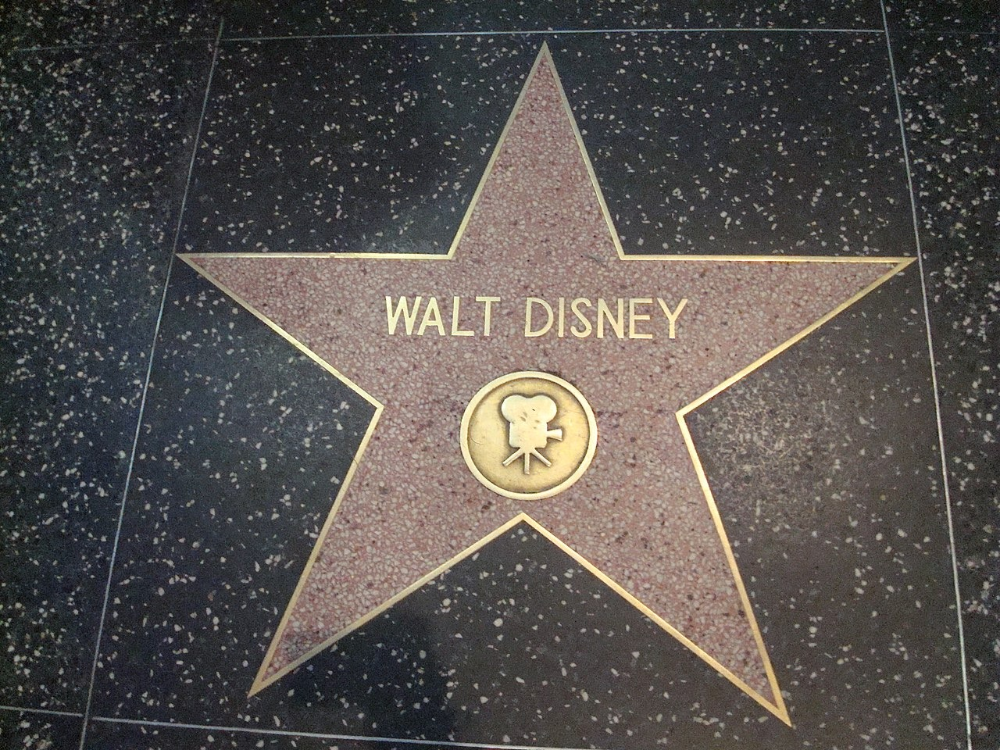
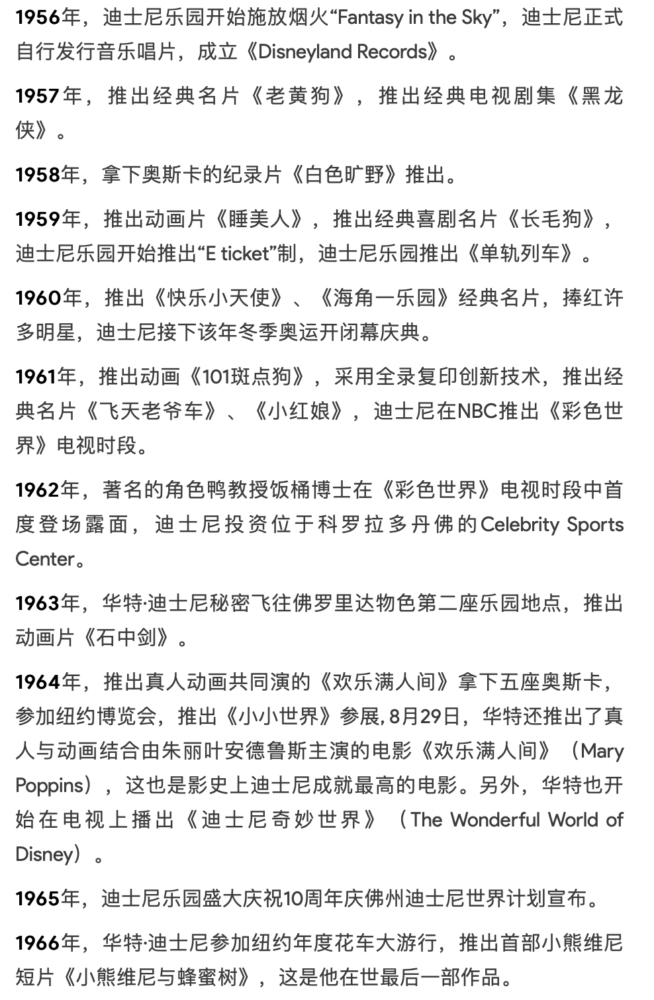
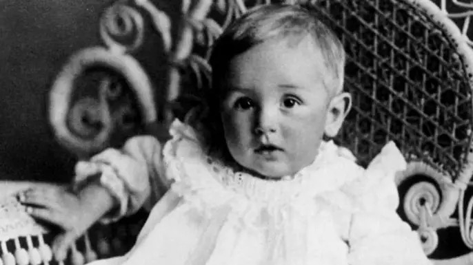
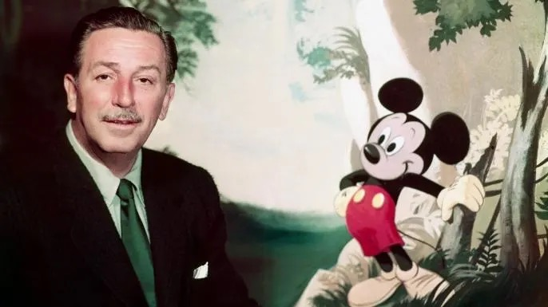
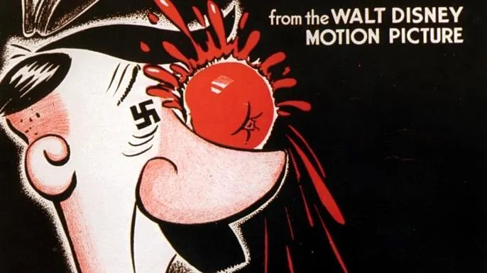
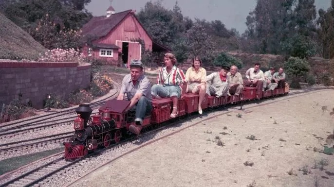
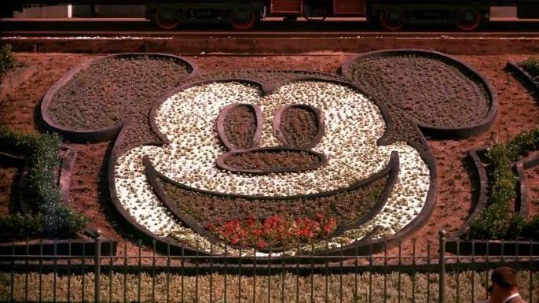
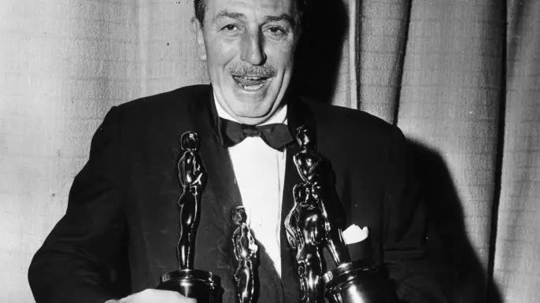

今天的Quote是：
> The way to get started is to quit talking and **begin doing**. -Walt Disney
> 开始的方法就是停止交谈并开始实干。——沃尔特·迪斯尼

### 华特·迪士尼
中国大陆又译沃尔特·迪斯尼，香港又译华特迪士尼，于1901年12月5日出生在美国伊利诺伊州芝加哥，与三哥罗伊·迪士尼为华特迪士尼公司共同创始人。他是世界最著名的电影制片人、导演、剧作家、配音演员和动画师之一，至今为止仍是世界上获得奥斯卡奖最多的人。

1955年，华特创建了世界上第一座迪士尼主题乐园——于1955年7月17日在美国加利福尼亚州阿纳海姆（Anaheim）的迪士尼乐园（Disneyland），并开始规划位于美国佛罗里达州奥兰多的迪士尼世界（Disney World，后来被罗伊O.迪士尼改为华特·迪士尼世界）。

1966年12月15日，华特·迪士尼在他刚过完65岁生日后十天，因为长期吸烟的关系，由于肺癌医治无效，突发心肌梗塞逝世。华特的遗体被火化，骨灰被安葬在加利福尼亚州格伦代尔的森林墓地，一块杂草丛生的小块土地上，在那里，立着一块小小的纪念碑。由于华特死后一切安排当时都没有公开，所以他遗体被速冻的谣言一直流传多年。

关于Walt Disney你可能不知道的7件事

1. Disney came from humble beginnings. 迪斯尼出身卑微。

2. He was the voice of Mickey Mouse. 米老鼠的配音是迪斯尼。

3. Disney produced propaganda films for the U.S. government during World War II. 迪斯尼在二战期间为美国政府制作宣传片。

4. He was a train buff. 他是个火车迷。

5. The initial plans for Disneyland were small-scale. 迪斯尼乐园的最初计划是小规模的。

6. He won more Academy Awards than anyone else. He won more Academy Awards than anyone else.
 

 7. Disney wasn’t cryogenically frozen. 迪斯尼不是低温冷冻的。
