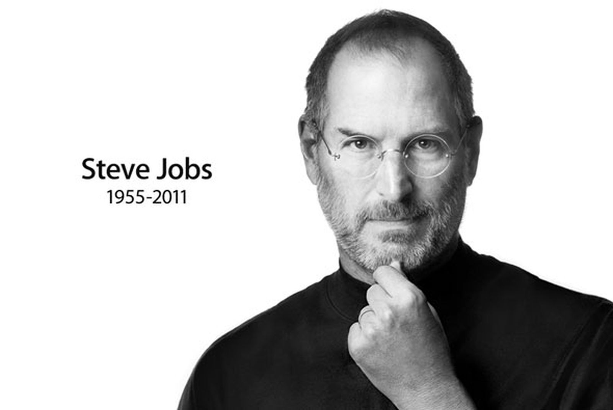
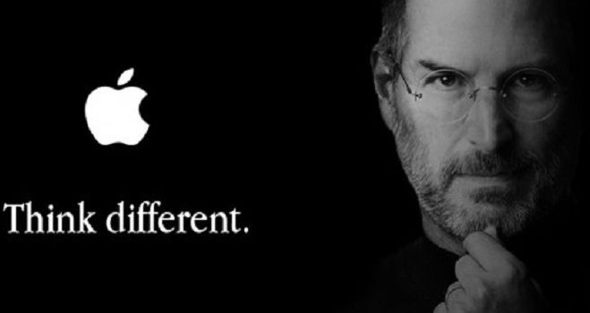
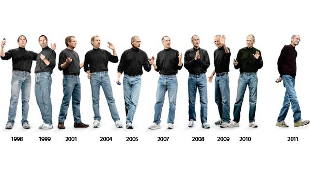
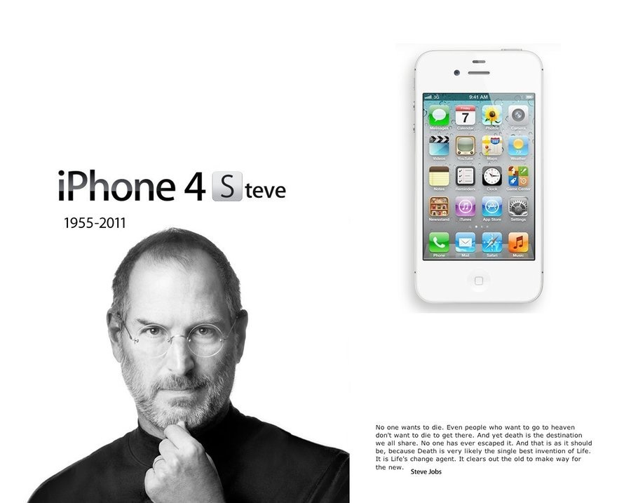

今天的quote是：
>Your time is limited, so don't waste it living someone else's life. 
> Don't be trapped by dogma – which is living with the results of other people's thinking. -Steve Jobs

你的时间是有限的，所以不要浪费时间过别人的生活。
不要被教条所束缚，教条就是活在别人思考的结果中

### 史蒂夫·乔布斯
史蒂夫·保罗·乔布斯（英语：Steven Paul Jobs，1955年2月24日－2011年10月5日），通称史蒂夫·乔布斯，是一名美国发明家、企业家、营销家，苹果公司联合创始人之一，曾任董事长、首席执行官职位，NeXT创办人及首席执行官，也是皮克斯动画创办人并曾任首席执行官，2006年为华特迪士尼公司董事会成员。2017年9月苹果发布会举行的地方，以他命名为 Steve Jobs Theater 。

### 11 Fascinating Facts About Steve Jobs
**1  The Origin Of Apple**
It is a known fact for most of us that Apple was co-founded by Steve jobs and his college dropout friend, Steve Wozniak, in Steve’s family garage.
众所周知，苹果是由史蒂夫·乔布斯和他的大学辍学朋友史蒂夫·沃兹尼亚克在史蒂夫家的车库里共同创立的。

However, what is a surprise is that, according to some, Steve Jobs named his company Apple after being inspired by the Beatles ‘Apple Records’, who started using this name in the 1960s.
A legal battle pursued and both parties settled the case in 2007.
然而，令人惊讶的是，根据一些人的说法，史蒂夫·乔布斯在受到披头士乐队“苹果唱片”的启发后，将他的公司命名为苹果公司，披头士乐队在20世纪60年代开始使用这个名字。
双方展开了一场官司，于2007年结案。

Other sources, and probably more close to the truth, say that Apple was so named because Jobs was coming back from an apple farm and he got the inspiration there. Steve Jobs said that the name Apple sounded like “fun, spirited and not intimidating”.
其他消息来源，可能更接近事实，说苹果之所以这样命名是因为乔布斯从苹果农场回来，他从那里得到了灵感。史蒂夫乔布斯说，苹果这个名字听起来像“有趣，精神和不吓人”。

**2  Steve’s Dress Code & Statement: Black Turtleneck Shirt & Blue Levi’s Jeans**
An eccentric fact about Jobs himself is that during his lifetime he owned close to 100 pairs of Levi’s jeans! Being his staple wardrobe, Jobs preferred to dress simply yet make a statement with his signature black turtleneck shirt (designed specifically for Steve Jobs by famous Japanese designer Issey Miyake) and blue Levi’s jeans.
乔布斯本人的一个古怪事实是，在他有生之年，他拥有近100条Levi's牛仔裤！作为乔布斯的主要衣橱，他更喜欢穿着简单，却又不失个性的黑色高领衬衫（日本著名设计师三宅一生为史蒂夫·乔布斯特别设计的）和蓝色Levi's牛仔裤。

**3 A Passion For Calligraphy**
As a student, Job’s biography has little to narrate! Even though he attended Reeds College for 18 months, guess which course attracted him the most… Calligraphy!
作为一名学生，乔布斯的传记几乎没有什么可叙述的！尽管他在里德斯学院就读了18个月，猜猜看哪门课程最吸引他: 书法！

**4 The Music On The iPod Of Steve Jobs: Only Artists In Line With His Values & Beliefs**
Job’s music library on his iPod was not just a random collection of hits.
The Beatles, Bob Dylan, Black Eyed Peas, Alicia Keys and John Mayer were some of the big names whose music he loved because he could relate to their values and beliefs.
乔布斯iPod上的音乐库不是随机收集的热门歌曲。
披头士乐队、鲍勃·迪伦、黑眼豆豆、艾丽西亚·凯斯和约翰·梅耶尔都是一些大牌，他喜欢他们的音乐，因为他们的价值观和信仰与他有关。

**5 Fish, Vegetables & Lots Of Fruits**
Steve Jobs was a ‘pescetarian’ by nature. Of his favorite foods, fish topped the list.
史蒂夫·乔布斯生来就是个“悲观主义者”。在他最喜欢的食物中，鱼居首位。

Walter Issacson’s biography of Steve Jobs reveals that he was fond of eating carrots and apples and could live on these two for days on end.
沃尔特·伊萨克森（Walter Issacson）的《史蒂夫·乔布斯传》透露，他喜欢吃胡萝卜和苹果，可以连续吃这两天。

**6  Steve Jobs, Employee #0 At Apple**
史蒂夫·乔布斯在苹果的ID是0号

**7  Steve Jobs’ Annual Salary At Apple, Inc: $1**
史蒂夫·乔布斯在苹果公司的年薪：1美元

**8 Steve Jobs Got Fired At Apple in 1985**
史蒂夫·乔布斯在1985年被苹果解雇

**9 Steve Jobs Only Met His Biological Sister Mona Simpson When He Was 27 Years Old**
史蒂夫·乔布斯27岁时才认识了他的亲生妹妹莫娜·辛普森

**10  Steve Jobs & Bill Gates: Good Friends In The End**
史蒂夫·乔布斯和比尔·盖茨一直都是好朋友

**11 The Release Of iPhone 4S in October 2011**
 2011年10月发布了iPhone4S

