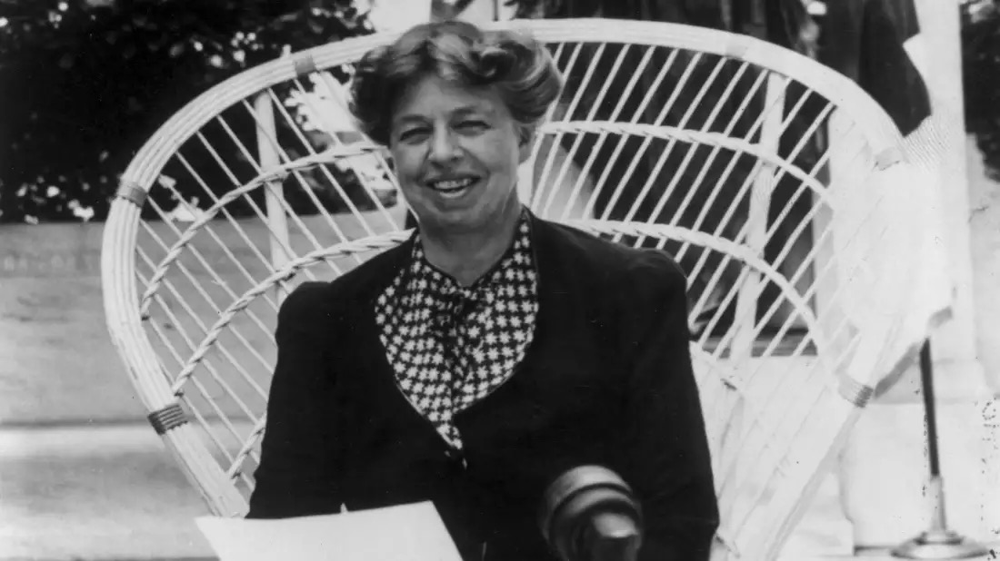
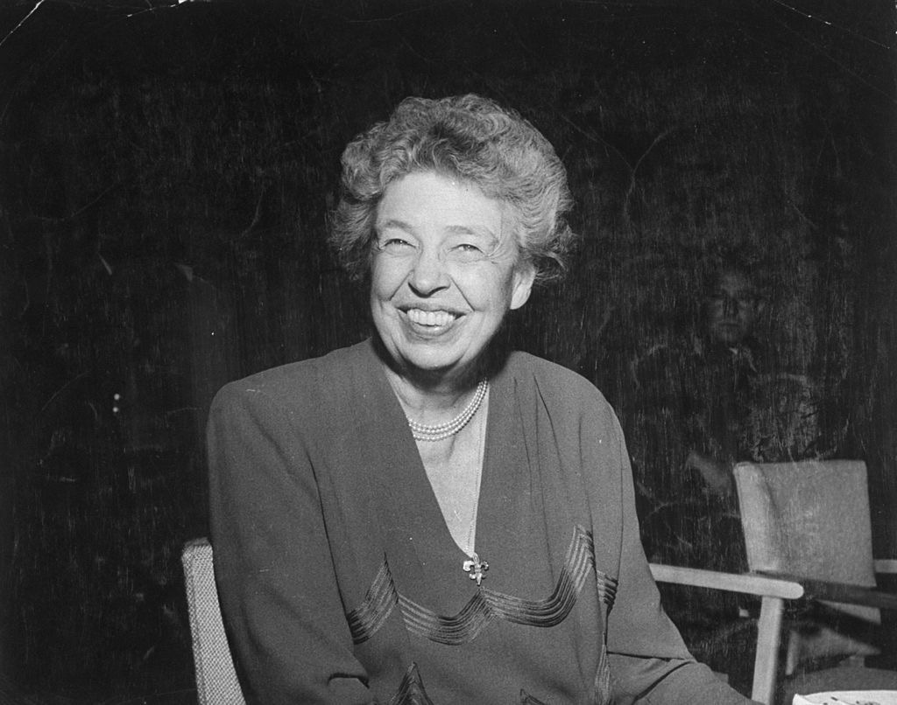
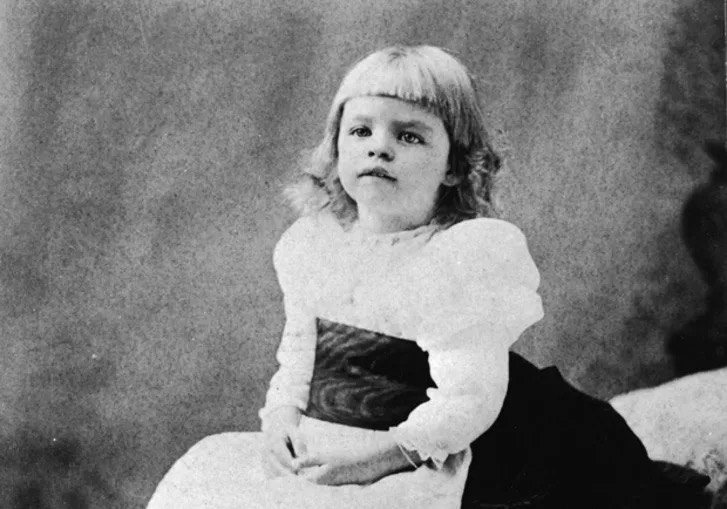
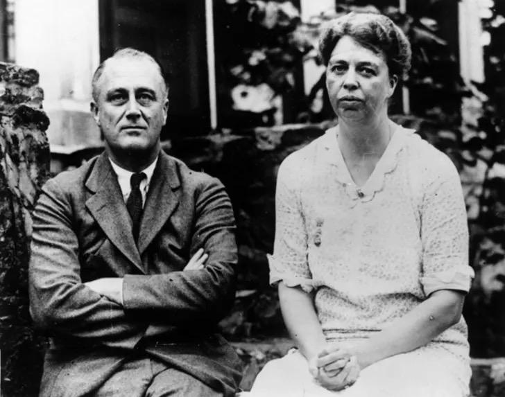

今天的Quote是：
>If life were predictable it would cease to be life, and be without flavor. -Eleanor Roosevelt
> 如果生活是可以预见的，那将不再是生活，也没有味道。 --埃莉诺·罗斯福

### Anna Eleanor Roosevelt
安娜·埃莉诺·罗斯福（英语：Anna Eleanor Roosevelt，1884年10月11日－1962年11月7日）是一位美国政治人物。第32任美国总统富兰克林·德拉诺·罗斯福妻子，从1933年3月至1945年4月罗斯福经历四个总统任期，因此埃莉诺·罗斯福也是美国任职时间最长的第一夫人。二战后她出任美国首任驻联合国大使，并主导起草了联合国的《世界人权宣言》。同时也是女性主义者，并大力提倡保护人权。哈里·S·杜鲁门总统在赞扬她的人权成就时称她为“**世界第一夫人**”。

### 简述
埃莉诺的祖父是狄·罗斯福，是纽约的大企业家及慈善家。伯父是泰迪·罗斯福，即老罗斯福总统。

父亲是埃利奥特·罗斯福一世，作为罗斯福和利文斯顿（Livingston）家族的一员，她有一个不幸的童年，她的父母和一个弟弟在她很小的时候去世。 15岁时，她在伦敦的Allenwood学院学习，校长Marie Souvestre是一个女权主义者，对埃莉诺影响很深。

回到美国后，1905年埃莉诺嫁给了远房堂叔富兰克林·德拉诺·罗斯福，尽管富兰克林的母亲十分反对该婚事。富兰克林因为脊髓灰质炎局部瘫痪后埃莉诺说服他继续从政。富兰克林当选纽约州长后，埃莉诺经常代表他公开露面。

尽管她的晚年广受尊重，罗斯福仍然因为她的坦率而成为一个有争议的第一夫人，尤其是她在种族问题上的立场。她是第一个举办新闻发布会的总统配偶，并在全国党代表大会发言。有几次，她公开表示不同意丈夫的政策。她在西弗吉尼亚州为失业的矿工家庭推出了一个试点社区，后来被广泛认为是一个失败的尝试。她倡导在工作场所扩大妇女角色，并为非裔美国人和亚裔美国人和二战难民争取公民权利。

她的丈夫去世后，埃莉诺依然活跃在政治舞台上。她成为美国驻联合国大使，并担任联合国人权委员会上主席，监督《世界人权宣言》的起草工作。后来，她成为肯尼迪政府妇女地位总统委员会的主席。她去世时，被视为“世界上最受尊敬的女人之一”和“几乎获得普遍尊重的对象”。1999年，她被排在盖洛普20世纪最受推崇的人物名单前十位。

### 11 Inspiring Facts About Eleanor Roosevelt
1. Eleanor was her middle name.
埃莉诺是她的中间名。

3. She was orphaned at a very young age.
她很小就成了孤儿。

5. She loved field hockey
她喜欢曲棍球

1. On her wedding day, then-president teddy roosevelt walked her down the aisle.
在她结婚那天，当时的总统泰迪·罗斯福陪她走上了婚礼的长廊。

1. She organized several women-only white house press conferences
她在白宫组织了几次妇女专用的记者招待会

3. She once went flying with Amelia Earhart
她曾经和阿米莉亚·埃尔哈特一起去飞行

5. She wrote a syndicated newspaper column for 27 years.
她写了27年的联合报专栏。

7. She defied Birmingham, alabama's segregation laws in a powerful protest
她藐视阿拉巴马州，伯明翰的种族隔离法在一个强大的抗议

9. She starred in a margarine commercial 
她主演了一个人造黄油广告

11. She helped draft the universal declaration of human rights
她帮助起草了《世界人权宣言》

13. She earned 35 honorary degrees.
她获得了35个荣誉学位。
