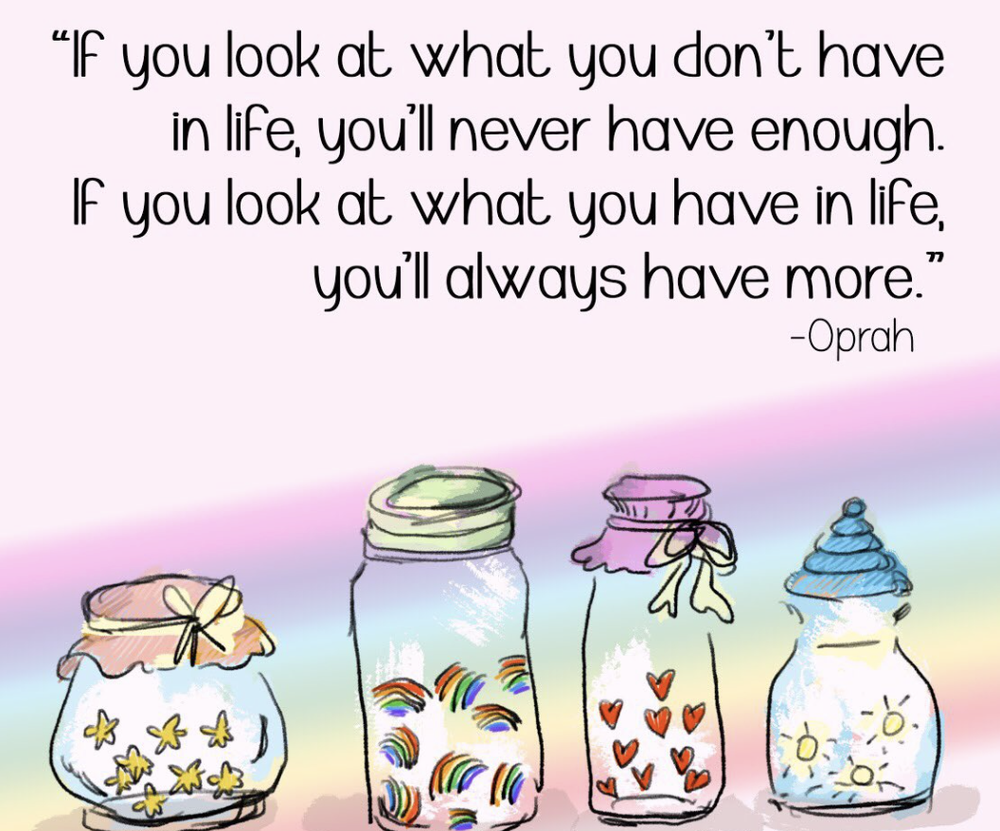
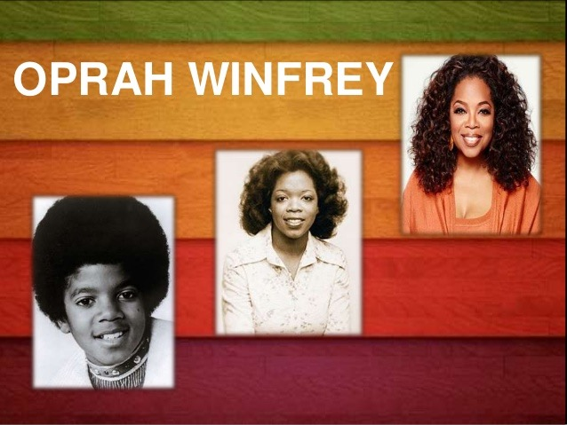
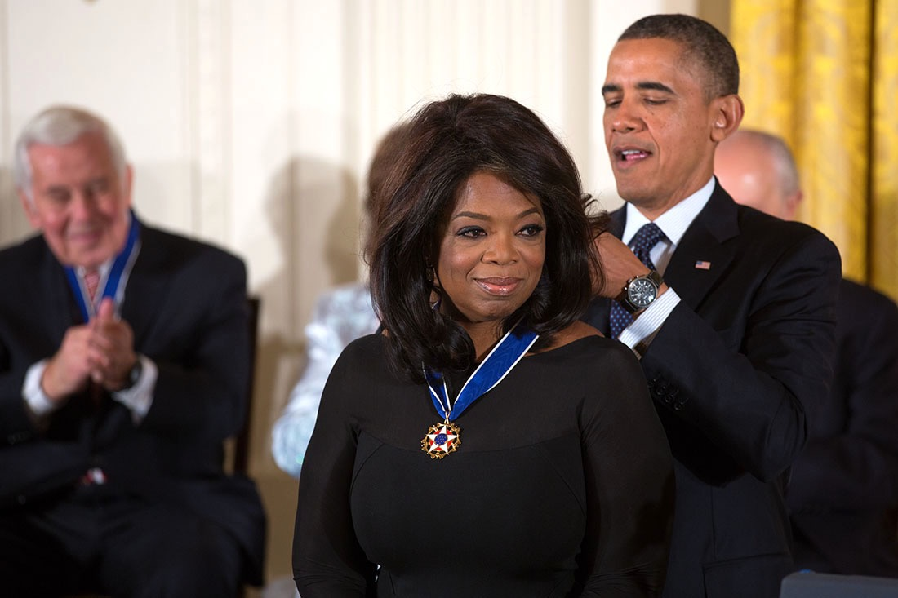

今天的Quote是：
> If you look at what you have in life, you'll always have more. If you look at what you don't have in life, you'll never have enough.  -Oprah Winfrey 
如果你只看你拥有的，你将拥有的更多；如果你只看你没有的，你将永远不会满足。」– 奥普拉·盖尔·温弗里

奥普拉·盖尔·温弗里（英语：Oprah Gail Winfrey，1954年1月29日），生于美国密西西比州，美国电视脱口秀主持人、制作人、投资家、慈善家及演员，美国最具影响力的非洲裔名人之一，时代百大人物。

她是入选时代百大人物次数最多者，总共9次。2005年美国在线举办票选活动—《最伟大的美国人》，她被选为美国最伟大的人物中的第九位。

### 14 cool facts about Oprah Gail Winfrey

1. Winfrey was named "Orpah" after the biblical character in the Book of Ruth on her birth certificate, but people mispronounced it regularly and "Oprah" stuck
温弗瑞的出生证明上以《路得记》中的圣经人物命名为“Orpah”，但人们经常发音错误，“Oprah”就是这样来的

2. As a child, Oprah Winfrey was nicknamed "The Preacher" for her ability to recite Bible verses as her grandmother often took her to church
小时候，奥普拉因能背诵圣经经文而被昵称为“传教士”，因为她的祖母经常带她去教堂

3. Winfrey was born the daughter of an unwed teen.
奥普拉是一个未婚少女的女儿。

4. At age 17, Winfrey won the Miss Black Tennessee beauty pageant.
17岁时，奥普拉赢得了田纳西州黑人小姐选美比赛。

5. Oprah Winfrey's family was so poor growing up that, as a child, Winfrey was teased at school for wearing dresses made of potato sacks.
奥普拉的家庭在成长过程中非常贫穷，小时候，奥普拉因为穿着土豆袋做的裙子在学校受到嘲笑。

6. Oprah Winfrey is at least 8% Native American--something she discovered when undergoing a DNA test for the PBS show African American Lives.
奥普拉·温弗瑞至少有8%是美国土著人，这是她在接受PBS“非洲裔美国人生活”节目DNA测试时发现的。

7. Winfrey had a son when she was 14 years old who died as an infant.
温弗瑞14岁时有一个儿子，但在婴儿时期就死了。

8. Oprah Winfrey openly discussed her childhood sexual abuse suffered at the hands of male relatives and her mother's friends on a special episode of her show focusing on sexual abuse in 1986.
奥普拉在1986年的一个特别节目中公开讨论了她童年在男性亲戚和母亲朋友手中遭受的性虐待。

9. Winfrey has donated her voice for an array cartoon characters, voicing Gussie the goose for Charlotte's Web, and Eudora, the mother of Princess Tiana in Disney's The Princess and the Frog, among others.
奥普拉为一组卡通人物献出了自己的声音，为《夏绿蒂的网》配音的鹅古斯，以及迪斯尼电影《公主与青蛙》中提安娜公主的母亲尤多拉等。

10. Oprah Winfrey has interviewed countless celebrities, including Michael Jackson, whose interview became the 4th most watched event in American television history, as well as the most watched interview of all-time, with 36 million viewers.
奥普拉采访过无数名人，其中迈克尔·杰克逊的采访成为美国电视史上第四大收视率事件，也是有史以来收视率最高的采访，拥有3600万观众。

11. Winfrey credits her grandmother for guiding her towards success, saying that it was Hattie Mae who encouraged her to speak up in public, giving Winfrey confidence at an early age and a positive sense of self.
奥普拉将自己的成功归功于祖母，她说是海蒂·梅鼓励她在公众面前直言不讳，让奥普拉在很小的时候就有了自信和积极的自我意识。

12. Winfrey was nominated for an Academy Award for Best Supporting Actress for her role in Steven Spielberg's The Color Purple.
温弗瑞因出演史蒂芬·斯皮尔伯格的《The Color Purple》获得奥斯卡最佳女配角提名。

13. Oprah Winfrey is the first black woman billionaire and the richest African-American woman.
奥普拉·温弗瑞是第一位黑人女性亿万富翁，也是最富有的非洲裔美国女性。

14. In 2013, Winfrey was awarded the Presidential Medal of Freedom (the nation's highest civilian honor) by President Barack Obama.
2013年，温弗里被美国总统奥巴马授予总统自由勋章（美国最高平民荣誉）。

