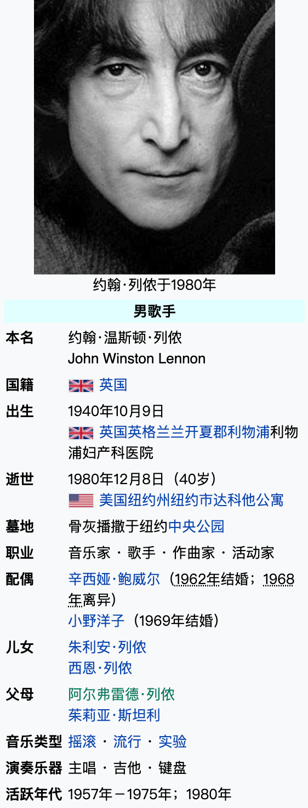
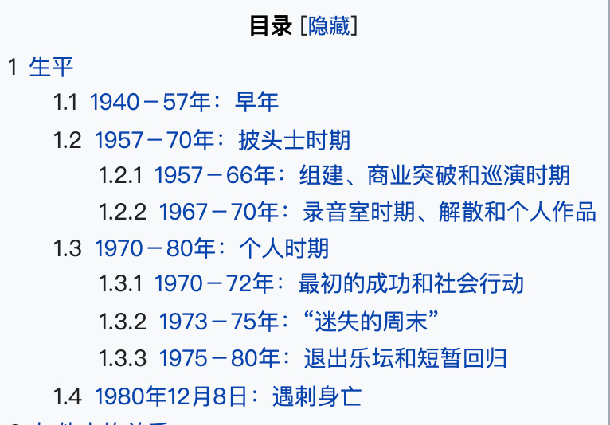

今天的Quote是：
"Life is what happens when you're busy making other plans." -John Lennon

生活，就是当你忙着做其他计划时，发生在你身上的事

约翰·温斯顿·小野·列侬，MBE（英语：John Winston Ono Lennon，出生名为John Winston Lennon；1940年10月9日－1980年12月8日）是一位英国歌手和词曲作者，作为披头士乐队的创始成员闻名全球，该乐队是流行音乐史上在商业上最成功的团体。他与乐队成员保罗·麦卡特尼组成了著名的列侬–麦卡特尼创作组合。

列侬在利物浦出生长大，在青少年时期参与了噪音爵士乐热潮；他的第一支乐队采石工人（the Quarrymen）在1960年转变为披头士乐队。披头士于1970年解散后，他开始了自己的个人职业生涯，发行了受好评的专辑《John Lennon/Plastic Ono Band》和《Imagine》，以及标志性的歌曲如《Give Peace a Chance》、《Working Class Hero》和《Imagine》。在1969年与小野洋子结婚后，他把名字改为约翰·小野·列侬。1975年，列侬从乐坛隐退，在家照顾年幼的儿子西恩。1980年，他和小野携新专辑《Double Fantasy》复出，在专辑发行三周后遇害。

列侬在他的音乐、写作、绘画、视频和采访中展现了他反叛的天性和尖酸的幽默。他因参与政治及和平运动而受到争议。1971年，他搬家到纽约市曼哈顿。在那里，列侬对越战的批评使理查德·尼克松政府长期试图把他驱逐出境。而他的一些歌曲被反战运动和60年代反文化运动视为圣歌。

### Here are 10 things you might not know about him
John Lennon was assassinated by Mark David Chapman outside his New York City residence on December 8, 1980.
1980年12月8日，约翰·列侬在纽约市住所外被马克·大卫·查普曼暗杀。

He was investigated by the FBI and was a talented drawer.
他被联邦调查局调查过，是个很有才华的人。

He was also overly critical of his own voice and The Beatles' catalog, going as far as to say he wanted to re-record every song The Beatles ever released. 
他还对自己的声音和披头士乐队的唱片目录过分挑剔，甚至说他想重新录制披头士乐队曾经发行的每一首歌。

John Lennon was raised by his aunt Mimi, who didn't particularly approve of his interest in pursuing music as a career.
约翰·列侬是由他的姑姑米米抚养大的，她并不特别赞同他把追求音乐作为职业的兴趣。

Lennon used to take naps in an old coffin, according to a biography of his one-time manager.
列侬曾经在一个旧棺材里小睡，根据他曾经的经理传记。

He shares a birthday with his son Sean.
他和儿子肖恩生日是一样的。

Sean Lennon found out his dad was a Beatle after seeing him on TV.
肖恩·列侬在电视上看到他的父亲后才发现他是披头士乐队的成员。

Lennon suffered from extreme near-sightedness.
列侬患有极度近视。

Two months before his death, Lennon revealed that The Beatles' song "Help!" reminded him of an unhealthy period of his life.
列侬在去世前两个月透露，披头士乐队的歌曲《Help》使他想起他生命中的一段不健康的时期。

