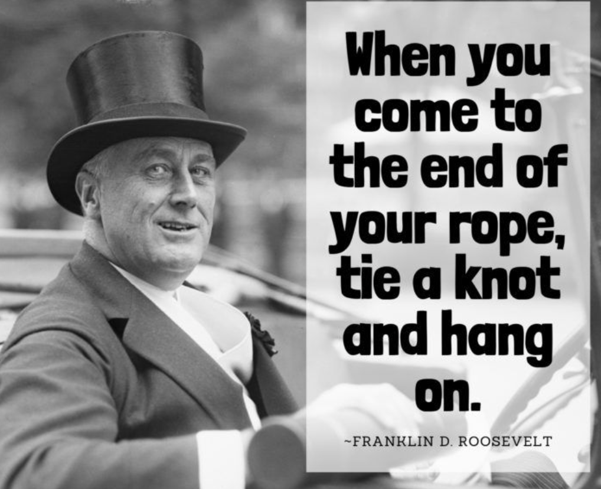

今天的Quote是：
> When you come to the end of your rope, tie a knot and hang on. --Franklin Delano Roosevelt
> 当你来到了你绳索的末端时，绑个结然后撑住。

这句话字面上好像没什么，但其实这里的绳子代表的是你的努力，当你觉得尽了一切的努力却还没得到你想要的，有时候你需要做的就是撑住，时间到了成功就是你的了！ 

### Franklin Delano Roosevelt
富兰克林·德拉诺·罗斯福（英语：Franklin Delano Roosevelt，1882年1月30日－1945年4月12日，姓名简称为FDR），民主党籍政治人物，第**32**任美国总统，荷兰裔美国人，是美国1920至1930年代经济危机和第二次世界大战的中心人物之一。从1933年至1945年间，连续出任四届美国总统，且是唯一连任超过两届的美国总统。 富兰克林·罗斯福的远房堂兄西奥多·罗斯福是第**26**任美国总统，故在中文世界经常称呼富兰克林·罗斯福为“小罗斯福”总统，而称狄奥多·罗斯福为“老罗斯福”总统。纽约市罗斯福家族出身。罗斯福是英语化的荷兰姓“van Rosevelt”或“van Rosenvelt”，原意为“玫瑰原野”[3]。虽然有些人读作[ˈruːzəvɛlt]，但罗斯福自己则习惯读作[ˈroʊzəvəlt]，母音如英文的rose。

### 8 Things You May Not Know About FDR
1. Roosevelt was distantly related to both his wife and 11 other presidents.
罗斯福与他的妻子和其他11位总统都是远亲。

2. He had little love for the law.
他对法律没有什么爱好。

3. FDR won all of his presidential elections in landslides.
罗斯福在2009年赢得了他所有的总统选举。

4. No president will ever serve longer (barring a constitutional change).
总统的任期不会再长了（除非修改宪法）。

5. His handicap was largely concealed from the public.
他的残疾基本上是对公众隐瞒的。

7. Roosevelt tried to increase the size of the Supreme Court.
罗斯福试图扩大最高法院的规模。

8. He sanctioned the imprisonment of Japanese-Americans.
他批准监禁日裔美国人。

9. FDR was the first sitting president to fly in a plane.
罗斯福是第一位坐飞机的现任总统。

****