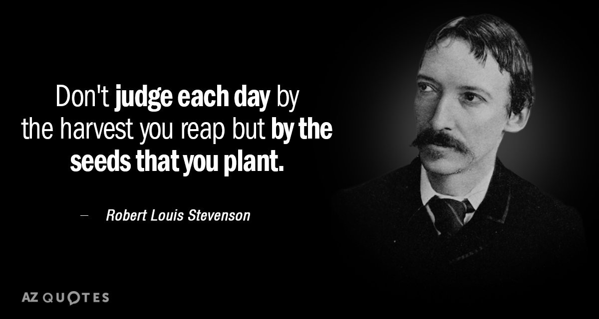
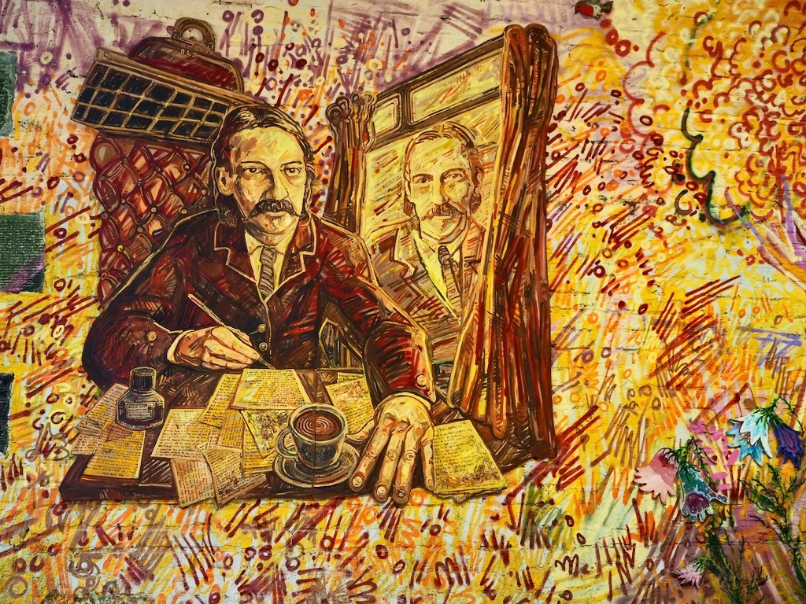
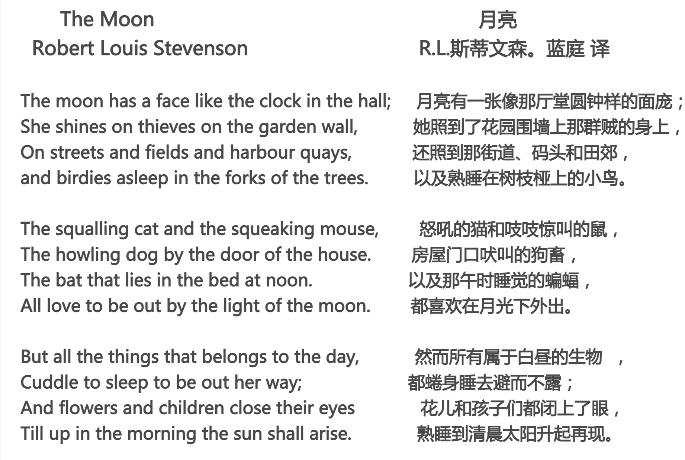

今天的Quote:
> Don't judge each day by the harvest you reap but by the seeds that you plant. -Robert Louis Stevenson

不要以收获来判断每一天，而要以播种来判断--- 罗伯特·路易斯·史蒂文森

### Robert Lewis Balfour Stevenson
罗伯特·路易斯·巴尔福·史蒂文森（英语：Robert Lewis Balfour Stevenson，1850年11月13日－1894年12月3日），苏格兰小说家、诗人与旅游作家，也是英国文学新浪漫主义的代表之一。包括欧内斯特·海明威、约瑟夫·鲁德亚德·吉卜林、豪尔赫·路易斯·博尔赫斯、弗拉基米尔·纳博科夫在内的许多作家都对史蒂文森评价颇高，而不少现代主义作家却对他并不认同，因为史蒂文森是大众化的，而且他的作品并不符合他们所定义的文学。直到最近，评论家开始审视史蒂文森而且将他的作品放入西方经典中。史蒂文森常常到处旅行，部分原因是寻找适合他治疗结核病的气候。

### 结婚与旅行
史蒂文森接下来的4年时光都花费在寻找一个对他身体有益的气候与旅行方面，史蒂文森前往枫丹白露、巴比松（Barbizon）、格雷兹（Grez）与内穆尔（Nemours）进行了长且频繁的旅行，而且他也成为了这些聚集在此的艺术家其中的一分子。史蒂文森也经常前往巴黎，拜访当地的画廊与剧院。在这段期间，史蒂文森结交了许多新朋友，并且遇见了未来的妻子－芬妮·范德格里夫特·奥斯朋(Fanny Vandegrift Osbourne)。这些新朋友包括了他的传记作者与经纪人西德尼·柯文（Sidney Colvin）与具有作家与评论家身份的莱斯里·史帝芬（Leslie Stephen）。史蒂文森后来将这段旅程描写在《内河航程》（An Inland Voyage）与《骑驴漫游记》（Travels with a Donkey in the Cévennes）中。史蒂文森也写了20篇以上的文章与评论，并且发表在许多杂志上。虽然对于史蒂文森的父母来说，他只是在浪费时间而且是一事无成的。不过事实上，史蒂文森不断的精进写作风格与扩展他对人生的认识。

史蒂文森与芬妮·范德格里夫特·奥斯朋于1876年在巴黎相遇，史蒂文森第一眼就爱上她了。在几个月后，芬妮返回了位于美国加利福尼亚州旧金山的家。而当史蒂文森得知芬妮生病的消息后，他决定前往加利福尼亚州。因为了解史蒂文森父亲的脾气，所以朋友劝告他取消这趟旅程，但是史蒂文森仍然在没有告知双亲的情况下启航前往美洲。后来史蒂文森前往德文郡，一部分是为了节省金钱，另一部分则为了学习其他人是如何旅行的，而且增加旅行的经历。史蒂文森从纽约搭乘火车横越大陆来到加利福尼亚州，后来他把这段经验写在《The Amateur Emigrant》与《横渡平原》（Across the Plains）中。虽然这对史蒂文森的文学是一个良好的历练，但是同时也损害了他的健康。当他抵达蒙特里(Monterey)时病情已经相当严重了，在当地一些人士的照顾之下，史蒂文森才逐渐恢复健康。

在1879年12月的时候，史蒂文森发现他的身体状况已经回复到可以继续前往旧金山的地步。史蒂文森在这里奋斗了几个月之久，“靠着大量的劳动与沉重的思考，一天只赚得了45分，有时候更少[4]”，在这期间他努力写作来支撑下去。但是在冬季结束前，史蒂文森的身体状况又再度衰弱下去，而且史蒂文森发现他的病情是非常严重的。这时芬妮已经恢复健康了，所以她前往照顾史蒂文森，直到他恢复健康为止。当史蒂文森的父亲知道他身体的状况后，资助了史蒂文森金钱度过这段时期。

史蒂文森与芬妮在1880年5月结婚，然后他与新妻子及继子从旧金山北部前往纳帕郡，花费一整个夏天在圣海伦山的废弃矿场度蜜月。后来史蒂文森出版了《银矿小径破落户》（The Silverado Squatters）来描述这段经历。之后史蒂文森想要进行南太平洋之旅，因为被他在《Overland》月刊的共同编辑人查尔斯（Charles Warren Stoddard，也是《South Sea Idylls》的作者）所激励。史蒂文森与他的家人在1880年8月从纽约回到了英国，发现他的双亲与朋友西德尼在利物浦的码头来迎接他，对史蒂文森的归来感到高兴。后来芬妮渐渐的靠着她的风趣与魅力来抚平史蒂文森与他的父亲之间的裂缝，而且让自己融入了新的家庭中。

### 诗《The Moon》

