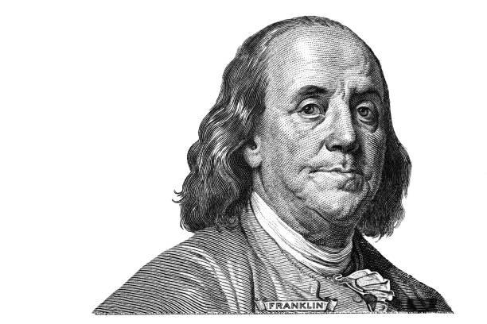
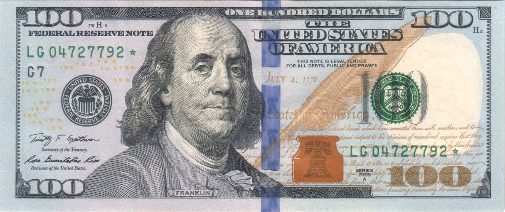

今天的Quote是：
>  Tell me and I forget. Teach me and I remember. Involve me and I learn. -Benjamin Franklin
给我讲过，我很快就忘记；给我讲解，我会记住；让我参与，我真正学会。 ——本杰明·富兰克林

富兰克林强调**学习中最重要的是参与和实践**，而不是知识性的灌输 

本杰明·富兰克林 FRS FRSE（英语：Benjamin Franklin，又译范克廉，1706年1月17日－1790年4月17日[3]），出生于美国麻省波士顿，美国博学家、开国元勋之一。他是杰出的政治家、外交家、科学家、发明家，同时亦是出版商、印刷商、记者、作家、慈善家、共济会的成员。作为科学家，他因电学发现和理论成为美国启蒙时代和物理学史上重要人物。作为发明家，他因避雷针、双目眼镜、富兰克林壁炉等闻名。他创立了许多民间组织，包括费城消防站和宾夕法尼亚大学。

17岁的富兰克林逃到宾夕法尼亚州费城，想在新的城市开始新的生活。初到时，他在城里几家印刷店里工作，但感到不满意。几个月后，州长威廉·吉斯男爵劝说富兰克林去伦敦获取设备，建立一家新报社。在伦敦时，富兰克林注意到这个想法华而不实，就在印刷店做排版，现为史密斯菲尔德圣巴多罗买大教堂。托马斯·德纳姆是位商人，雇佣富兰克林做店员、图书管理员，在他的帮助下1726年富兰克林回到费城。

本杰明·富兰克林1743年开始筹备一家学院，八年后学院成立，即为宾州大学的前身。与此同时，他开始研究电及其他科学问题。

1748年，本杰明·富兰克林退出了他的印刷生意，不过他仍然能从他的合伙人手中分得印刷店可观的利润，亦因此有时间进行他各项发明和研究，当中包括了他对电的研究。

1751年，富兰克林协助创办费城学院，担任首位校长，学院后为宾夕法尼亚大学。他组织创办美国哲学会，任首位秘书，在1769年担任主席。富兰克林代表众殖民地前往伦敦，力劝议会撤销不得人心的印花税法案，成为美国民族英雄。作为杰出外交家，他在法国巴黎大受欢迎，在建立积极的美法同盟上贡献巨大，这些努力在美国独立战争期间起关键作用，确保革命能从法国获得补给。

在费城做邮政多年后，富兰克林于1753年成为殖民地邮政代理总长，建立首个全国通讯系统。在革命期间，他成为美国首任邮政总长。富兰克林积极参与社区、殖民地、州际、全国、国际各项事务。1785至1788年，他担任宾夕法尼亚州长。最初，富兰克林拥有并贩售奴隶，但到1750年他释放仆人，从经济角度表示反对，成为废奴主义者中杰出代表。

富兰克林人生传奇多彩，科学与政治上遗产丰富，在众开国元勋中雄踞鳌头，之后两个世纪纪念不断，多次在美国货币(半美元硬币/100美元纸币)、舰船、城郡、学院、公司及各类文化活动再现。

### 道德十三条
1726年富兰克林20岁，试图总结出道德十三条，并在日后实践。在自传中，他列出：
“**节制**：食不过饱，饮不过量；”
“**节言**：于人于己不利的话不说，避免琐碎的闲聊；”
“**秩序**：物件有所归，办事有定时；”
“**决心**：该做的事情一定要做，决心要做的事情一定要做好；”
“**节俭**：花钱要于人于已有利，决不浪费；”
“**勤劳**：珍惜时间， 时间要花在做有用的事情上，力戒无意义的举动；”
“**诚实**：力戒虚伪欺诈，心存良知与公正，说话亦如此；”
“**正直**：不做有损他人的事情，要做对人们有益的事情，这是你的义务；”
“**中庸**：不走极端， 别人对你的冒犯， 若是正当，就要善于容忍；”
“**整洁**：身体、衣物以及住所，要保持清洁；”
“**宁静**：对待琐事、平常事或者不可避免之事，不可自扰；”
“**贞节**：不要纵欲过度，有伤身体，切忌损害自己或者他人的安宁和名誉；”
“**谦虚**：仿效耶稣与苏格拉底。”

富兰克林不是一蹴而就，而是每周一项，“等到一种美德养成了习惯，再实行下一项”。富兰克林没有完全做到，许多时候自认失败，但这极大地促进自己进步，有助成功与幸福，因而在自传里用了更多篇幅研究该计划，写道：“因此我希望，我的一些子嗣能够从效法榜样中获益。

