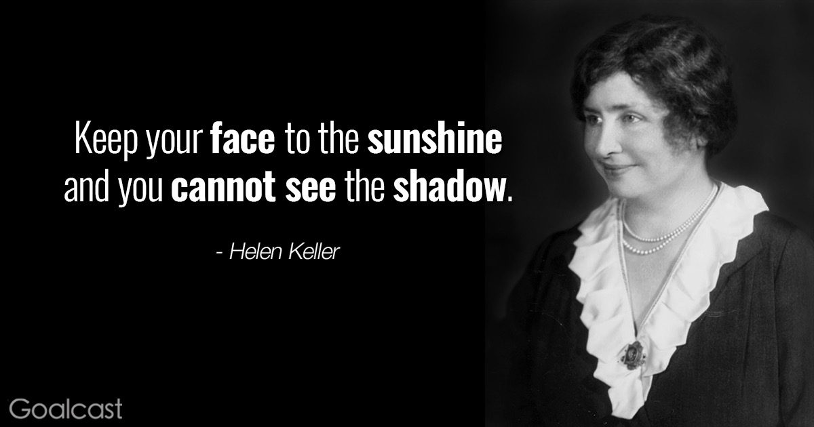
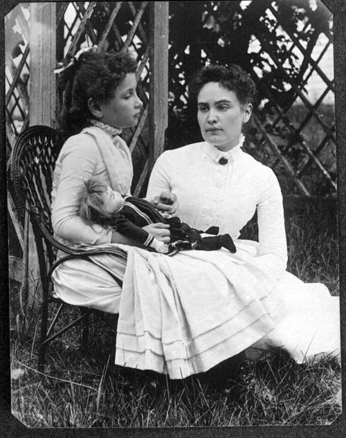
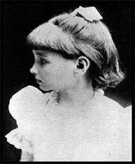
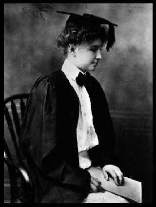
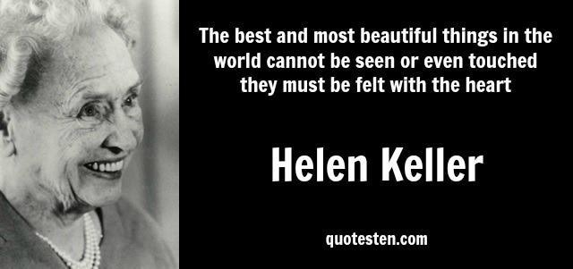

今天的quote是：
> Keep your face to the sunshine and you cannot see the shadow.  --Helen Keller
> 面对光明，阴影就在我们身后。--海伦·凯勒

海伦·凯勒（英语：Helen Adams Keller，1880年6月27日－1968年6月1日）美国作家，社会运动家和讲师。凯勒小时候同时失明与失聪，却凭借老师的耐心教导和自己的勤奋努力，完成了大学教育并成为作家和教育家，成为一个励志的奇迹。

她一岁七个月时因急性脑充血引致失明及失聪，也使她无法说话。在1887年，借着她的导师安妮·莎莉文对她耐心的教导和关爱，并找到专家使她学会发音，让她学会流畅的表达，才开始与其他人沟通并接受教育。1896年，年仅16岁的海伦·凯勒，面临父亲病逝，安妮·苏利文要她不要过于伤心，反倒要努力读书，考取大学，以告慰父亲的在天之灵。在安妮·莎莉文的长期陪伴下，最终海伦·凯勒不但学会阅读和说话，还以惊人的毅力完成了哈佛大学的学业并于1904年毕业，成为有史以来第一个获得文学学士学位的盲聋人士。成年后，她继续广泛阅读和刻苦学习，掌握了英语、法语、德语、拉丁语和希腊语，成为盲聋的作家和教育家。1936年，安妮·莎莉文老师病逝，享年70岁，她结束陪伴海伦·凯勒的47个年头。在那之后，海伦·凯勒更积极参加演讲，希望能把老师对她的爱，继续传讲下去，一直到她过世。她致力于残疾人士事业，四处募捐以改善残疾人的生活环境和受教育水平。她的事迹使她入选美国《时代周刊》“人类十大偶像之一”，被授予“总统自由奖章”。

### 生平

海伦·凯勒于1880年6月27日出生在美国阿拉巴马州的塔斯坎比亚 。海伦·凯勒原为健康的婴儿，但在19个月大的时候患了急性脑充血病，失去了听觉和视觉。长大后运用自创的手语与家庭成员沟通。随着年岁的增长，简单的交流不能满足她，脾气变得暴躁。6岁时，她的父母在家庭医生的协助下，邀请柏金斯启明学校的安妮·苏利文老师作为海伦·凯勒的启蒙导师 。

莎莉文老师先了解海伦的脾气躁动的原因：他的父母不忍心看她做错事（打人、不守规矩、破坏东西等）被惩罚的样子，于是在她做错事时都给她糖果吃。她纠正父母的不正确行为，并且与海伦建立互信的关系，再耐心教导手语，让她能与别人沟通，再教导她一些生字，她第一个学会的单字是水（water）。其后再教导使用手指点字以及生活礼仪。10岁时她父母聘请了霍勒斯曼学校的莎拉·傅乐瓦老师教导其说话，她把中指放在老师鼻子上、食指放在嘴唇上、大拇指放在咽喉上，而海伦亦学会说话。

1896年，海伦·凯勒进入了位于马萨诸塞州的剑桥女子学校。1900年秋季进入哈佛大学拉德克利夫高研院（Radcliffe College）就读。于1904年以优异成绩取得文学学士学位，并成为首位毕业于高等院校的聋盲人。这些年来莎莉文一直留在海伦·凯勒身边，并将教科书与上课内容写在海伦·凯勒的手掌上。

海伦于1924年组成海伦·凯勒基金会，并加入美国盲人基金会，作为其全国和国际的关系顾问。其后她在国际狮子会的年会上演说，她要求狮子会成为“协助失明人士战胜黑暗的武士”。并说：“我为你们开启机会的窗，我正敲着你的大门。”1946年任美国全球盲人基金会国际关系顾问，共访问35个国家。她争取在世界各地兴建盲人学校，并常去医院探望病人，分享她的经历。

1968年海伦·凯勒在家中去世，享寿87岁，先前经历多次中风。

