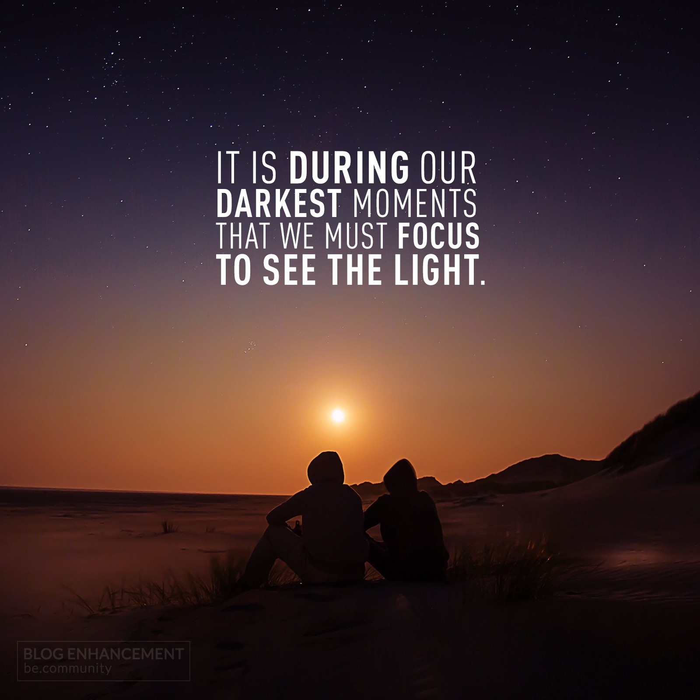
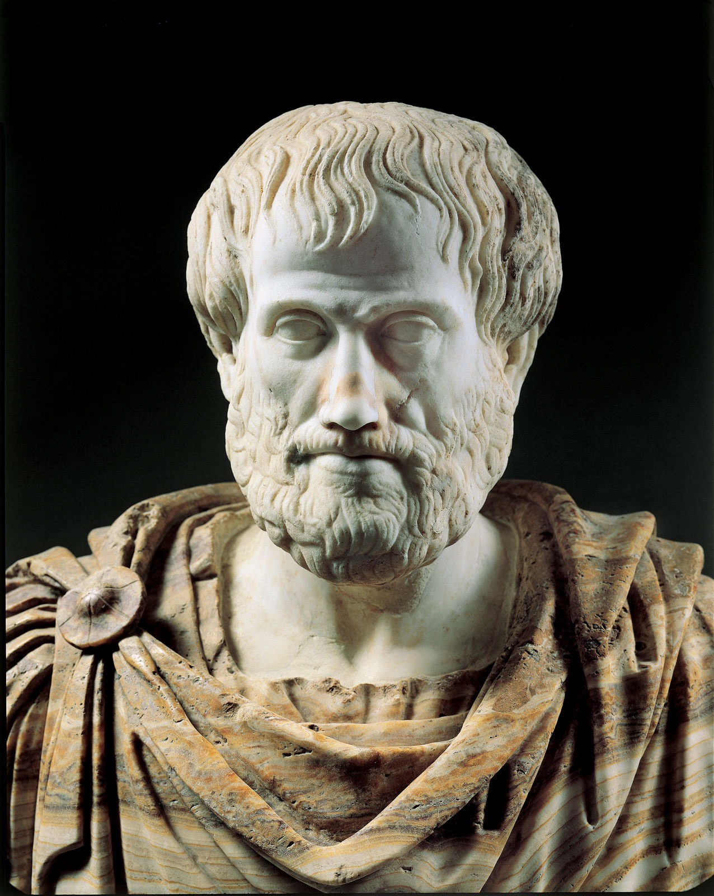
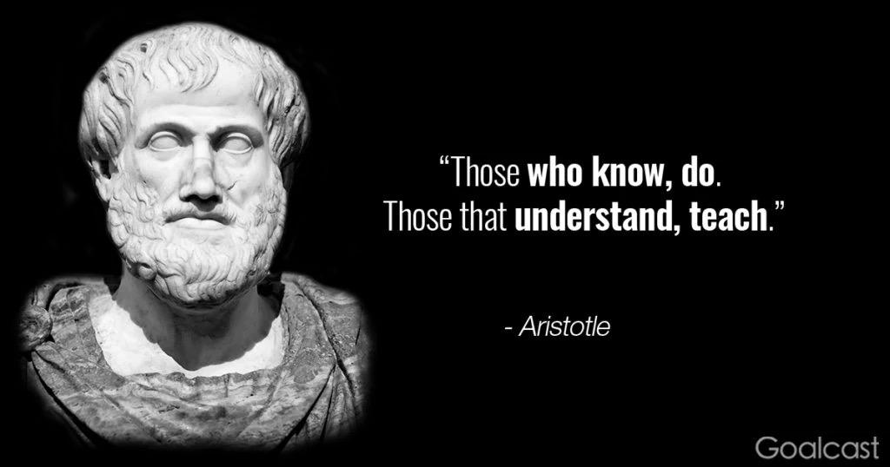

今天的Quote是：
> It is during our darkest moments that we must focus to see the light. -Aristotle
> 「越是在黑暗的时候，我们越要集中精神去寻找光明。 ​」– 亚里斯多德

亚里士多德（希腊语：Αριστοτέλης，Aristotélēs，前384年6月19日－前322年3月7日），古希腊哲学家，柏拉图的学生、亚历山大大帝的老师。他的著作牵涉许多学科，包括了物理学、形而上学、诗歌（包括戏剧）、音乐、生物学、经济学、动物学、逻辑学、政治、政府、以及伦理学。和柏拉图、苏格拉底（柏拉图的老师）一起被誉为西方哲学的奠基者。亚里士多德的著作是西方哲学的第一个广泛系统，包含道德、美学、逻辑和科学、政治和形上学。

### 影响
亚里士多德留下的著作成为最完整而又最具影响力的哲学系统之一，或许高过史上任何的一个思想家[6]。他单独创立了逻辑学、生物学、以及心理学，某种程度上他被认为是科学研究方法之父。他也在两千年前的《政治学》一书中预言了工业革命的来临：“如果每个机器都能制造其各自的零件，服从人类的指令和计划…如果梭子会自己来回飞动、如果弦拨会自己弹奏竖琴，完全不需人手操控，工头将不再需要领导工人，奴隶主也不再需要指挥奴隶了。”[7]

经院哲学的思想家如托马斯·阿奎纳将亚里士多德称为“哲学家”，这些思想家将亚里士多德的哲学与基督教思想混合，将古希腊的哲学带入中世纪。不过，在混合的过程中他们也不得不抛弃了一些亚里士多德的科学和美术原则，以免基督教思想与现代科学法则和观察法则产生冲突。中世纪的英国诗人乔叟便曾描写道他的学生：

>“	在他的床上有着
>二十本黑色或红色封面的书
>藏着亚里士多德和他的哲学。
>”

意大利诗人但丁则将亚里士多德布置在第一层地狱里：
>“	我看见了熟习各种技艺的人们，
>在哲学家的圈子里，
>带着我的钦佩和崇敬，
>我看见了柏拉图，也看见了苏格拉底
>他就站在离柏拉图旁边最近的位置。
>”
> 
后来的德国哲学家尼采曾表示他的哲学思想几乎完全来自于亚里士多德。亚里士多德的伦理和道德原则也被一些现代哲学家如艾茵·兰德所吸收和发扬。

最后再分享一句：

