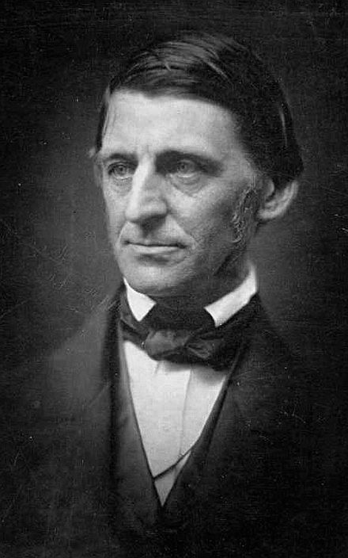
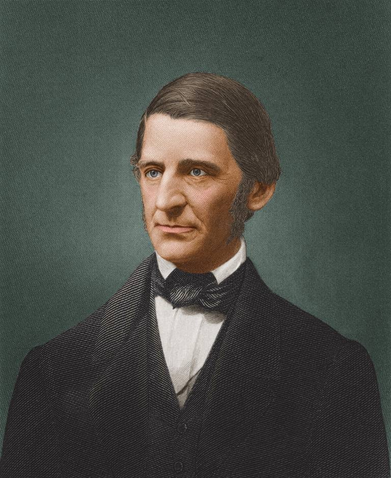
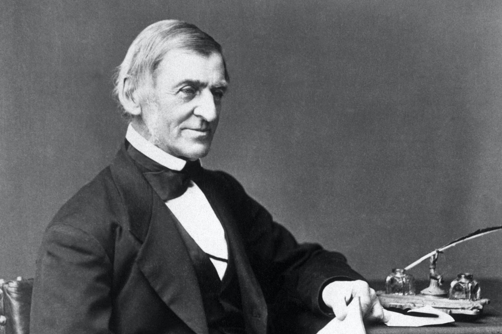

今天的Quote是：
>  Don't be too timid and squeamish about your actions. All life is an experiment. The more experiments you make the better.  --Ralph Waldo Emerson
> 人的一生就是进行尝试，尝试的越多，生活就越美好。--拉尔夫·沃尔多·爱默生

### Ralph Waldo Emerson
拉尔夫·沃尔多·爱默生（英语：Ralph Waldo Emerson，1803年5月25日－1882年4月27日），生于波士顿，美国思想家、文学家。

### 生平与经历
爱默生出生于波士顿，他的父亲是威廉·爱默生是一位知名的一位论派牧师。他逐渐从他相信的教义趋向公式化，并在小品《论自然》（Nature）（1837年）发表超越论的哲学。

爱默生在即将过八岁的两周前父亲过世（1811年），隔年他被送到了波士顿拉丁学校就读。在1817年10月爱默生14岁时，他入读哈佛大学并且被任命为新生代表，这个身份让他获得免费住宿的机会。为了增添微薄的薪水，寒假期间他会到Ripley 伯父在马萨诸塞州沃尔瑟姆市的学校进行辅导及教学事务。

1821年爱默生从哈佛大学毕业后，他协助自己的兄弟在母亲的家中设立一所给年轻女性就读的学校，这是在他于切尔姆斯福德 设立自己的学校以后的事；当爱默生的兄弟前往哥廷根读神学时，爱默生负责主持这所学校。之后数年，爱默生都过着担任校长的日子，然后进了哈佛大学神学院，并于1829年以一位论派牧师的形象崭露头角。1832年，一次与教会干事关于圣餐服务的管理权争执及关于公众祈祷的疑虑让他辞职了。

他的第一任妻子是埃伦·塔克，她在二十岁时因罹患肺结核于1831年2月8日过世。

爱默生是查尔斯·爱默生（Charles Wesley Emerson）的远亲。查尔斯也同样是论派牧师，他以自己的姓氏为名成立了爱默生学院（Emerson College）。他们的祖先汤玛斯·爱默生是在1640年移民至马萨诸塞州的易普威治定居，是这个牧师家庭的先驱。

在1832年至33年间，爱默生到欧洲旅游，这段经历记载在《英国人的性格》（English Traits）（1856年）中。在旅途中，他遇到了威廉·华兹华斯、柯尔律治、约翰·斯图尔特·密尔和托马斯·卡莱尔。在旅程结束后，爱默生与凯雷仍继续联系，直至凯雷于1881年逝世，爱默生在美国充当凯雷的代理人。爱默生的旅游地点不限于英国，他也去了法国（于1848年）、意大利和中东。

1835年，爱默生在美国马萨诸塞州康科特买了一所屋子，很快就成为城中最重要的市民之一。他在那里亦娶了第二任妻子利迪亚·杰克逊。他称她为利迪亚人而她称他为爱默生先生，俩人生下的孩子是华都、艾伦、伊蒂丝和爱德华·爱默生。艾伦是以他前妻的名字命名，这是利迪亚的建议。

### 超验主义思想
爱默生是美国文化精神的代表人物，美国总统林肯称他为“美国的孔子”、“美国文明之父”。以爱默生思想为代表的超验主义是美国思想史上一次重要的思想解放运动，被称为“美国文艺复兴”。超验主义强调人与上帝间的直接交流和人性中的神性，具有强烈的批判精神。

### 往期文章 
